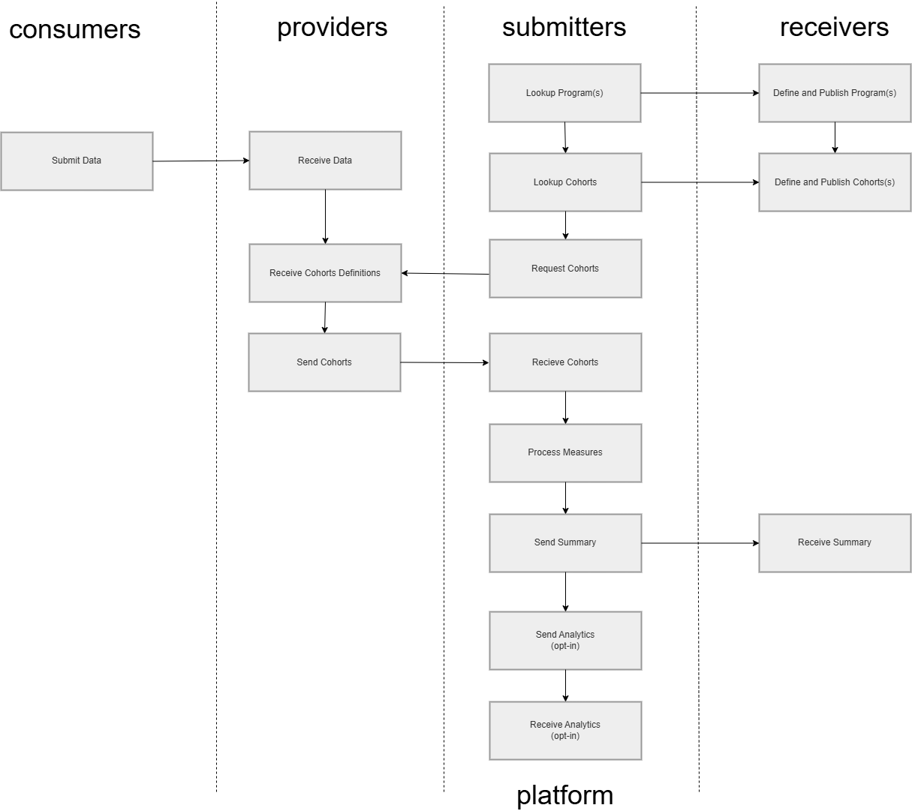
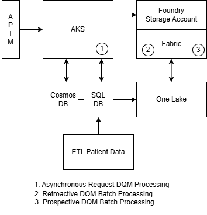
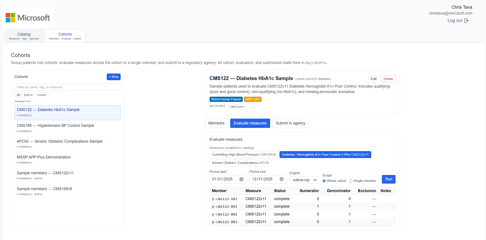

# Azure Healthcare Digital Quality Platform

End-to-end reference implementation for an Azure healthcare digital quality platform. 

#### Platform Architecture

Five independently deployable stacks, Consumers, Providers, Submitters, Receivers, and Platform, and the four data exchanges between them: SOAP notes and encounters from Consumers to Providers, patient data from Providers to Submitters, measurement reports plus prospective-measurements-forecast from Submitters to Receivers, and an opt-in analytics of MeasureReport digests plus RL surveillance telemetry from Submitters to the Platform tenant.



#### Workflow

This is a default operational sequence across Consumers, Providers, Submitters, Receivers, and Platform. 

Consumers are patients that are the center of their own care. Providers and Consumers exchange information. Receivers define and publish programs and cohort definitions, Providers receive cohort definitions and send back cohorts, and Submitters request cohorts, process measures, and send the summary to Receivers. Platform optionally keeps track of analytics.



#### Stack Architecture

Per-stack runtime shared by all five stacks: request flow through API Management to AKS, workload identity, connections to AI Foundry, Cosmos DB, AI Search, and Storage, with observability through Azure Monitor and Application Insights.




The same stack serves three distinct digital quality measure (DQM) processing modes:

- **Asynchronous request DQM processing** — single-patient, on-demand evaluation. The frontend or an external caller posts one request through APIM to the backend, the orchestrator computes the measure against the patient's FHIR bundle, and the resulting `MeasureReport` is returned to the caller and persisted in `dq/cohorts`.
- **Retroactive DQM batch processing** — cohort-wide evaluation over a closed measurement period (defaults to the previous full calendar year to match CMS retrospective reporting). The Workbench fans out one orchestrator call per cohort member, aggregates the population counts, and packages the results into a `WorkbenchSubmission` for the selected regulatory agency program.
- **Prospective DQM batch processing** — forward-looking forecast for an open or upcoming measurement period. The orchestrator combines partial-period FHIR data with RL surveillance telemetry to project performance and surface at-risk patients before the period closes, so submitters can intervene rather than just report.

<p align="center">
  
</p>


## Components

Each stack contains three components. Paths below use the Submitters stack as the canonical example; the Receivers and Consumers stacks mirror the same layout, and the Platform and Providers stacks ship as phase-0 FastAPI stubs that will be filled out in later phases.

The Consumers stack adds a patient-facing intake surface on top of the shared layout: SOAP notes per encounter, multi-encounter sample patients, and on-demand local execution of the three accelerator measures (CMS122v11, CMS165v9, ePC02v1) against a single patient's FHIR bundle. See [`consumers/backend/src/soap_notes.py`](consumers/backend/src/soap_notes.py), [`consumers/backend/src/local_measures.py`](consumers/backend/src/local_measures.py), and [`consumers/frontend/src/pages/PatientsPage.tsx`](consumers/frontend/src/pages/PatientsPage.tsx).

- [`submitters/orchestrator/`](submitters/orchestrator) — MCP service that executes digital quality measures. The orchestrator provisions the Azure platform and runs the MCP service that computes digital quality measures.
- [`submitters/backend/`](submitters/backend) — FastAPI backend exposing quality-measure build and test APIs. The backend exposes build and test APIs and delegates measure execution to the orchestrator.
- [`submitters/frontend/`](submitters/frontend) — React + Vite single-page app authenticating with MSAL for building and testing quality measures. The frontend lets users build and test quality measures.

### Orchestrator ([`submitters/orchestrator/`](submitters/orchestrator))

The orchestrator provides the platform's infrastructure and the MCP service that executes digital quality measures. It deploys via `azd` (Bicep templates in [`submitters/_infra/`](submitters/_infra)) and runs as the `dq` workload on AKS, fronted by Azure API Management with OAuth and Azure Workload Identity. The backend calls the orchestrator to compute CQL/AI-driven digital quality measures.

For detailed architecture diagrams and component specifications, see [_docs/AGENTS_ARCHITECTURE.md](_docs/AGENTS_ARCHITECTURE.md).

### Backend ([`submitters/backend/`](submitters/backend))

FastAPI backend (Python 3.11 + Uvicorn/Gunicorn) deployed to AKS. Exposes digital quality measure build and test APIs and delegates execution to the orchestrator's MCP service.

- **Identity**: Microsoft Entra ID JWT bearer auth on `/api/*`; Azure Workload Identity for outbound Azure access
- **Telemetry**: OpenTelemetry → Azure Monitor / Application Insights
- **Ingress**: NGINX Ingress terminates TLS; the frontend reverse-proxies `/api` traffic to this service

### Frontend ([`submitters/frontend/`](submitters/frontend))



React 18 + TypeScript 5 + Vite 6 single-page app served by nginx behind an NGINX Ingress on AKS. Authenticates users via Microsoft Entra ID (MSAL) with group-based authorization and reverse-proxies `/api` to the backend.

- **Quality Measures Build** — author and configure digital quality measures
- **Quality Measures Test** — execute quality measures and review results
- **Quality Measures Workbench** — Catalog and Cohort surfaces backed by the `dq/catalog` and `dq/cohorts` Cosmos containers (see [Workbench](#quality-measures-workbench) below)

Stack: React, TypeScript, Vite, Redux Toolkit, MSAL Browser/React, Tailwind CSS, Axios.

---

## Repository Layout

The repo is organized as five independently deployable stacks (`consumers/`, `providers/`, `submitters/`, `receivers/`, `platform/`) plus underscore-prefixed support directories shared by all stacks.

```text
azure-healthcare-digital-quality-platform/
├── .azure/                 # azd environments (per-stack)
├── _data/                  # Test FHIR bundles and seed catalog data
├── _docs/                  # Architecture, identity, evaluation docs
├── _evals/                 # Quality-measure evaluation harness
├── _images/                # README assets
├── _measures/              # CQL + markdown measure definitions
├── _scripts/               # Bootstrap and operational scripts
├── _tests/                 # Integration tests
├── consumers/              # Consumers stack (patient-facing intake)
│   ├── azure.yaml
│   ├── docker-compose.yml
│   ├── _data/              # Multi-encounter sample patients (FHIR R4)
│   ├── _infra/             # Bicep (AKS, APIM, Cosmos, ...)
│   ├── backend/
│   │   ├── src/            # SOAP notes router, local-measure evaluator
│   │   ├── k8s/
│   │   └── Dockerfile
│   └── frontend/
│       ├── src/            # Patients tab + SOAP editor
│       ├── k8s/
│       ├── nginx/
│       └── Dockerfile
├── providers/              # Providers stack (phase-0 stub)
│   ├── main.py
│   ├── requirements.txt
│   └── docker-compose.yml
├── submitters/             # Submitters stack (active)
│   ├── azure.yaml
│   ├── docker-compose.yml
│   ├── _infra/             # Bicep (AKS, APIM, Cosmos, Foundry, ...)
│   ├── backend/
│   │   ├── src/
│   │   ├── k8s/
│   │   └── Dockerfile
│   ├── frontend/
│   │   ├── src/
│   │   ├── k8s/
│   │   ├── nginx/
│   │   └── Dockerfile
│   └── orchestrator/
│       ├── src/
│       ├── k8s/
│       └── Dockerfile
├── receivers/              # Receivers stack (mirrors submitters layout)
│   ├── azure.yaml
│   ├── docker-compose.yml
│   ├── _infra/
│   ├── backend/
│   ├── frontend/
│   └── orchestrator/
└── platform/               # Platform stack (phase-0 stub)
    ├── main.py
    ├── requirements.txt
    └── docker-compose.yml
```

---

#### Buildtime Architecture

Developer workflow with VS Code, GitHub Copilot, the Python ecosystem, GitHub Actions CI/CD with parallel App Build and Infra Build tracks, and deployment to Azure with human-in-the-loop approvals.




---

## Deployment

### Prerequisites

#### Development Tools

- [Python 3.11+](https://www.python.org/downloads/)
- [Node.js 20+](https://nodejs.org/)
- [pip](https://pip.pypa.io/en/stable/installation/)
- [uv](https://docs.astral.sh/uv/getting-started/installation/)
- [VS Code](https://code.visualstudio.com/download)
- [GitHub Copilot](https://github.com/features/copilot) with premium coding models (GPT-5.2-Codex, Claude 4.5 Opus, Sonnet)

#### Azure & Container Tools

- [Azure CLI](https://learn.microsoft.com/cli/azure/install-azure-cli)
- [Azure Developer CLI](https://learn.microsoft.com/azure/developer/azure-developer-cli/install-azd)
- [kubectl](https://kubernetes.io/docs/tasks/tools/) (with [port-forward](https://kubernetes.io/docs/reference/kubectl/generated/kubectl_port-forward/) capability)
- [Docker Desktop](https://docs.docker.com/desktop/)

#### Azure Access Requirements

- Azure Subscription with Owner privileges (recommended)
- Quota for compute used in AKS node pool VMs
- Quota for language and embedding models in [Azure AI Foundry](https://learn.microsoft.com/azure/ai-foundry)

### Quick Start

```bash
azd auth login
azd up
```

The `azd up` command deploys all infrastructure and automatically configures:

- AKS cluster with Container Registry
- API Management with OAuth endpoints
- Orchestrator MCP service with workload identity
- LoadBalancer service connected to the APIM backend

### Per-Service Build & Deploy

Each app folder has its own Dockerfile and Kubernetes manifest. The backend and orchestrator Dockerfiles `COPY` from `submitters/<svc>/...`, `_data/`, and `_measures/`, so the build context must be the repo root. Build and roll images independently (example shown for the Submitters stack; substitute `receivers/` for the Receivers stack):

```bash
# Orchestrator
docker build -t <acr>.azurecr.io/orchestrator:<tag> -f submitters/orchestrator/Dockerfile .
docker push     <acr>.azurecr.io/orchestrator:<tag>
kubectl set image deploy/orchestrator \
  orchestrator=<acr>.azurecr.io/orchestrator:<tag> \
  -n dq

# Backend
docker build -t <acr>.azurecr.io/backend:<tag> -f submitters/backend/Dockerfile .
docker push     <acr>.azurecr.io/backend:<tag>
kubectl set image deploy/backend \
  backend=<acr>.azurecr.io/backend:<tag> \
  -n dq

# Frontend (build context is the frontend folder itself)
docker build -t <acr>.azurecr.io/frontend:<tag> ./submitters/frontend
docker push     <acr>.azurecr.io/frontend:<tag>
kubectl set image deploy/frontend \
  frontend=<acr>.azurecr.io/frontend:<tag> \
  -n dq
```

Or bring the whole stack up locally with the per-stack compose file:

```bash
cd submitters && docker compose up --build
# or
cd receivers  && docker compose up --build
```

---

## Verification

```bash
# Verify pods
kubectl get pods -n dq

# Verify services
kubectl get svc -n dq

# Run integration tests
python _tests/test_mcp_connection.py --use-az-token
```

### AKS operational notes

- If application pods fail with `failed calling webhook mutation.azure-workload-identity.io`, wait for `azure-wi-webhook-controller-manager` in `kube-system` to be `Running`, then `kubectl rollout restart` the affected workload.
- If nodes appear `NotReady` with "Kubelet stopped posting node status", VMSS instances in `MC_<cluster>_<region>` may be `PowerState/deallocated`. Start them directly: `az vmss start -g MC_<cluster>_<region> -n <vmss-name>` (the `az aks start` command only works on a `Stopped` cluster).
- Roll new container images with `kubectl set image` rather than re-applying the manifest, so AKS-managed env / secret / workload-identity wiring on service accounts is preserved.

---

## Related Repositories

- [azure-healthcare-digital-quality-cql-sqk](https://github.com/ctava-msft/azure-healthcare-digital-quality-cql-sqk) — CQL execution SDK consumed by the orchestrator

---

## Documentation

| Document                                                            | Description                                      |
| ------------------------------------------------------------------- | ------------------------------------------------ |
| [AGENTS_ARCHITECTURE.md](_docs/AGENTS_ARCHITECTURE.md)               | Platform architecture and component diagrams     |
| [AGENTS_DEPLOYMENT_NOTES.md](_docs/AGENTS_DEPLOYMENT_NOTES.md)       | Detailed deployment notes                        |
| [AGENTS_IDENTITY_DESIGN.md](_docs/AGENTS_IDENTITY_DESIGN.md)         | Identity architecture design                     |
| [AGENTS_EVALUATIONS.md](_docs/AGENTS_EVALUATIONS.md)                 | Evaluation framework for quality measures        |
| [AGENTS_TEST_RESULTS.md](_docs/AGENTS_TEST_RESULTS.md)               | Integration test results                         |
| [DEFENDER_FOR_CLOUD.md](_docs/DEFENDER_FOR_CLOUD.md)                 | Defender for Cloud deployment and testing guide  |
| [SECURITY_REVIEW.md](_docs/SECURITY_REVIEW.md)                       | Security review: private networking and identity |
| [PURVIEW_INTEGRATION.md](_docs/PURVIEW_INTEGRATION.md)                | Purview data governance and compliance guide     |
| [REFACTORING_PLAN.md](_docs/REFACTORING_PLAN.md)                     | Four-stack refactor plan and phase tracker       |

---

## References

### Azure Services

- [Azure AI Foundry](https://learn.microsoft.com/azure/ai-foundry)
- [Azure AI Search](https://learn.microsoft.com/azure/search/)
- [Azure API Management](https://learn.microsoft.com/azure/api-management/)
- [Azure Bicep](https://learn.microsoft.com/azure/azure-resource-manager/bicep/)
- [Azure CLI](https://learn.microsoft.com/cli/azure/)
- [Azure Container Registry](https://learn.microsoft.com/azure/container-registry/)
- [Azure Cosmos DB](https://learn.microsoft.com/azure/cosmos-db/)
- [Azure Developer CLI (azd)](https://learn.microsoft.com/azure/developer/azure-developer-cli/)
- [Azure Kubernetes Service (AKS)](https://learn.microsoft.com/azure/aks/)
- [Azure Managed Grafana](https://learn.microsoft.com/azure/managed-grafana/)
- [Azure Storage](https://learn.microsoft.com/azure/storage/)
- [Microsoft Purview](https://learn.microsoft.com/purview/)

### Identity & Security

- [Microsoft Entra ID](https://learn.microsoft.com/entra/identity/)
- [Workload Identity Federation](https://learn.microsoft.com/azure/aks/workload-identity-overview)
- [Microsoft Defender for Cloud](https://learn.microsoft.com/azure/defender-for-cloud/)
- [Microsoft Purview Data Catalog](https://learn.microsoft.com/azure/purview/catalog-introduction)
- [Microsoft Purview Data Lineage](https://learn.microsoft.com/azure/purview/concept-data-lineage)

### Tools

- [MCP Inspector](https://github.com/modelcontextprotocol/inspector)
- [Model Context Protocol](https://modelcontextprotocol.io)

### Python Frameworks

- [aiohttp](https://docs.aiohttp.org/)
- [Azure Identity SDK](https://learn.microsoft.com/python/api/azure-identity/)
- [Azure Cosmos SDK](https://learn.microsoft.com/python/api/azure-cosmos/)
- [Azure Search Documents SDK](https://learn.microsoft.com/python/api/azure-search-documents/)
- [Azure Storage Blob SDK](https://learn.microsoft.com/python/api/azure-storage-blob/)
- [FastAPI](https://fastapi.tiangolo.com/)
- [NumPy](https://numpy.org/)
- [Pydantic](https://docs.pydantic.dev/)
- [Python](https://www.python.org/)
- [python-dotenv](https://pypi.org/project/python-dotenv/)
- [Uvicorn](https://www.uvicorn.org/)

### Frontend Frameworks

- [React](https://react.dev/)
- [TypeScript](https://www.typescriptlang.org/)
- [Vite](https://vitejs.dev/)
- [Redux Toolkit](https://redux-toolkit.js.org/)
- [MSAL React](https://learn.microsoft.com/entra/identity-platform/msal-react-overview)
- [Tailwind CSS](https://tailwindcss.com/)
- [Headless UI](https://headlessui.com/)
- [Heroicons](https://heroicons.com/)
- [Axios](https://axios-http.com/)

### DevOps Tools

- [Docker Desktop](https://docs.docker.com/desktop/)
- [GitHub Copilot](https://github.com/features/copilot)
- [kubectl](https://kubernetes.io/docs/reference/kubectl/)
- [uv](https://docs.astral.sh/uv/)
- [VS Code](https://code.visualstudio.com/)
