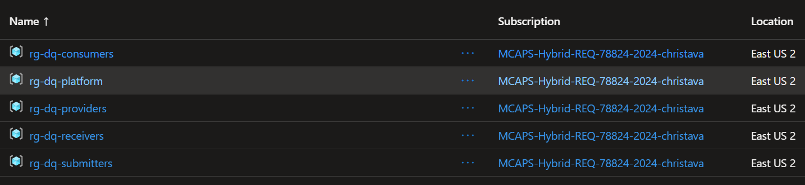
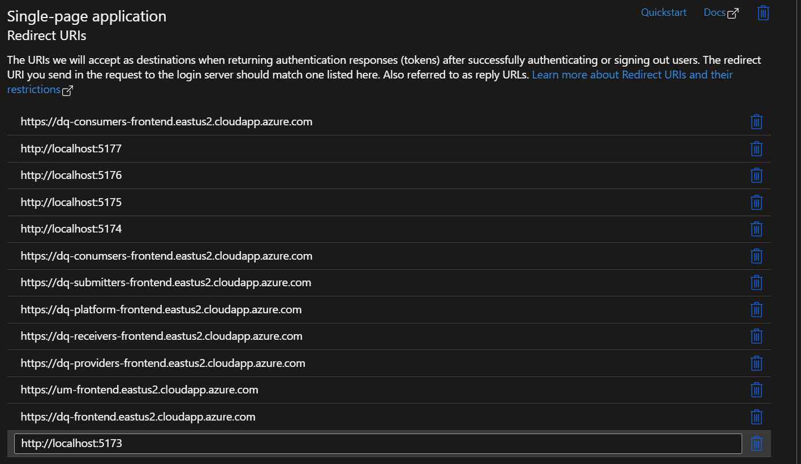
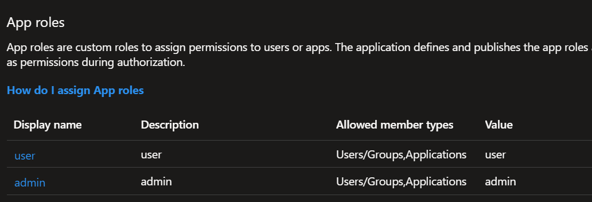
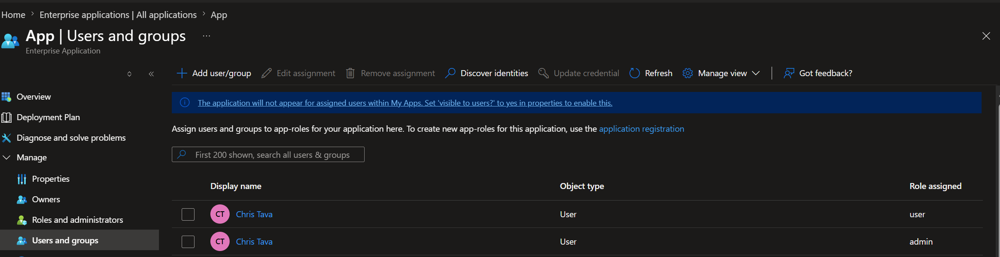

# Azure Healthcare Digital Quality Platform

End-to-end reference implementation for an Azure healthcare digital quality platform. 

#### Platform Architecture

Five independently deployable stacks, Consumers, Providers, Submitters, Receivers, and Platform, and the four data exchanges between them: SOAP notes and encounters from Consumers to Providers, patient data from Providers to Submitters, measurement reports plus prospective-measurements-forecast from Submitters to Receivers, and an opt-in analytics of MeasureReport digests plus RL surveillance telemetry from Submitters to the Platform tenant.


#### Workflow

This is a default operational sequence across Consumers, Providers, Submitters, Receivers, and Platform. 

Consumers are patients that are the center of their own care. Providers and Consumers exchange information. Receivers define and publish programs and cohort definitions, Providers receive cohort definitions and send back cohorts, and Submitters request cohorts, process measures, and send the summary to Receivers. Platform optionally keeps track of analytics.


#### Stack Architecture

Per-stack runtime shared by all five stacks: request flow through API Management to AKS, workload identity, connections to AI Foundry, Cosmos DB, AI Search, and Storage, with observability through Azure Monitor and Application Insights.


The same stack serves three distinct digital quality measure (DQM) processing modes:

- **Asynchronous request DQM processing.** Single-patient, on-demand evaluation. The frontend or an external caller posts one request through APIM to the backend, the orchestrator computes the measure against the patient's FHIR bundle, and the resulting `MeasureReport` is returned to the caller and persisted in `dq/cohorts`.
- **Retroactive DQM batch processing.** Cohort-wide evaluation over a closed measurement period (defaults to the previous full calendar year to match CMS retrospective reporting). The Workbench fans out one orchestrator call per cohort member, aggregates the population counts, and packages the results into a `WorkbenchSubmission` for the selected regulatory agency program.
- **Prospective DQM batch processing.** Forward-looking forecast for an open or upcoming measurement period. The orchestrator combines partial-period FHIR data with RL surveillance telemetry to project performance and surface at-risk patients before the period closes, so submitters can intervene rather than just report.

<p align="center">
  
</p>


## Components

Every stack (`consumers/`, `providers/`, `submitters/`, `receivers/`, `platform/`) ships the same skeleton: a Python 3.11 FastAPI `backend/`, a React 18 + Vite 6 `frontend/`, and Bicep templates under `_infra/`. The Consumers and Providers stacks additionally mount the SOAP-notes and sample-patients routers, and the Submitters and Receivers stacks additionally ship an MCP `orchestrator/` service. Paths below use the Submitters stack as the canonical example.

The Consumers stack adds a patient-facing intake surface on top of the shared layout: SOAP notes per encounter, multi-encounter sample patients, and on-demand local execution of the three accelerator measures (CMS122v11, CMS165v9, ePC02v1) against a single patient's FHIR bundle. See [`consumers/backend/src/soap_notes.py`](consumers/backend/src/soap_notes.py), [`consumers/backend/src/local_measures.py`](consumers/backend/src/local_measures.py), and [`consumers/frontend/src/pages/PatientsPage.tsx`](consumers/frontend/src/pages/PatientsPage.tsx).

- [`submitters/orchestrator/`](submitters/orchestrator). MCP service that executes digital quality measures. The orchestrator provisions the Azure platform and runs the MCP service that computes digital quality measures.
- [`submitters/backend/`](submitters/backend). FastAPI backend exposing quality-measure build and test APIs. The backend exposes build and test APIs and delegates measure execution to the orchestrator.
- [`submitters/frontend/`](submitters/frontend). React + Vite single-page app authenticating with MSAL for building and testing quality measures. The frontend lets users build and test quality measures.

### Orchestrator ([`submitters/orchestrator/`](submitters/orchestrator))

The orchestrator provides the platform's infrastructure and the MCP service that executes digital quality measures. It deploys via `azd` (Bicep templates in [`submitters/_infra/`](submitters/_infra)) and runs as the `dq` workload on AKS, fronted by Azure API Management with OAuth and Azure Workload Identity. The backend calls the orchestrator to compute CQL/AI-driven digital quality measures.

For the non-negotiable platform principles and the full technical specification, see [_docs/CONSTITUTION.md](_docs/CONSTITUTION.md) and [_docs/SPECIFICATION.md](_docs/SPECIFICATION.md).

### Backend ([`submitters/backend/`](submitters/backend))

FastAPI backend (Python 3.11 + Uvicorn/Gunicorn) deployed to AKS. Exposes digital quality measure build and test APIs and delegates execution to the orchestrator's MCP service.

- **Identity**: Microsoft Entra ID JWT bearer auth on `/api/*`; Azure Workload Identity for outbound Azure access
- **Telemetry**: OpenTelemetry → Azure Monitor / Application Insights
- **Ingress**: NGINX Ingress terminates TLS; the frontend reverse-proxies `/api` traffic to this service

### Frontend ([`submitters/frontend/`](submitters/frontend))


React 18 + TypeScript 5 + Vite 6 single-page app served by nginx behind an NGINX Ingress on AKS. Authenticates users via Microsoft Entra ID (MSAL) with group-based authorization and reverse-proxies `/api` to the backend.

- **Quality Measures Build.** Author and configure digital quality measures.
- **Quality Measures Test.** Execute quality measures and review results.
- **Quality Measures Workbench.** Catalog and Cohort surfaces backed by the `dq/catalog` and `dq/cohorts` Cosmos containers, served from the `/api/workbench/*` router in [`submitters/backend/src/workbench.py`](submitters/backend/src/workbench.py).

Stack: React, TypeScript, Vite, Redux Toolkit, MSAL Browser/React, Tailwind CSS, Axios.


---

## Repository Layout

The repo is organized as five independently deployable stacks (`consumers/`, `providers/`, `submitters/`, `receivers/`, `platform/`) plus four underscore-prefixed support directories shared by all stacks.

```text
azure-healthcare-digital-quality-platform/
├── _data/
│   ├── cohorts.json
│   ├── measures.json
│   ├── measures-tags.json
│   ├── patients.json
│   ├── regulatory-agencies.json
│   └── regulatory-agency-programs.json
├── _docs/
│   ├── CONSTITUTION.md
│   └── SPECIFICATION.md
├── _images/
├── _measures/
│   ├── CMS122v11_DiabetesHbA1cPoorControl.cql
│   ├── CMS122v11_DiabetesHbA1cPoorControl.md
│   ├── CMS165v9_ControllingHighBloodPressure.cql
│   ├── CMS165v9_ControllingHighBloodPressure.md
│   ├── ePC02_SevereObstetricComplications.cql
│   └── ePC02_SevereObstetricComplications.md
├── consumers/
│   ├── azure.yaml
│   ├── docker-compose.yml
│   ├── _data/
│   │   ├── consumers_soap_notes.json
│   │   └── sample_patients/
│   ├── _infra/
│   │   ├── main.bicep
│   │   ├── main.parameters.json
│   │   ├── abbreviations.json
│   │   ├── app/
│   │   ├── core/
│   │   └── hooks/
│   ├── backend/
│   │   ├── Dockerfile
│   │   ├── requirements.txt
│   │   ├── src/
│   │   └── k8s/
│   └── frontend/
│       ├── Dockerfile
│       ├── package.json
│       ├── vite.config.ts
│       ├── src/
│       ├── nginx/
│       └── k8s/
├── providers/
│   ├── azure.yaml
│   ├── docker-compose.yml
│   ├── _data/
│   │   ├── consumers_soap_notes.json
│   │   └── sample_patients/
│   ├── _infra/
│   │   ├── main.bicep
│   │   ├── main.parameters.json
│   │   ├── abbreviations.json
│   │   ├── app/
│   │   ├── core/
│   │   └── hooks/
│   ├── backend/
│   │   ├── Dockerfile
│   │   ├── requirements.txt
│   │   ├── src/
│   │   └── k8s/
│   └── frontend/
│       ├── Dockerfile
│       ├── package.json
│       ├── vite.config.ts
│       ├── src/
│       ├── nginx/
│       └── k8s/
├── submitters/
│   ├── azure.yaml
│   ├── docker-compose.yml
│   ├── requirements.txt
│   ├── _infra/
│   │   ├── main.bicep
│   │   ├── main.parameters.json
│   │   ├── abbreviations.json
│   │   ├── app/
│   │   ├── core/
│   │   └── hooks/
│   ├── backend/
│   │   ├── Dockerfile
│   │   ├── requirements.txt
│   │   ├── src/
│   │   └── k8s/
│   ├── frontend/
│   │   ├── Dockerfile
│   │   ├── package.json
│   │   ├── vite.config.ts
│   │   ├── src/
│   │   ├── nginx/
│   │   └── k8s/
│   └── orchestrator/
│       ├── Dockerfile
│       ├── requirements.txt
│       ├── src/
│       └── k8s/
├── receivers/
│   ├── azure.yaml
│   ├── docker-compose.yml
│   ├── _infra/
│   │   ├── main.bicep
│   │   ├── main.parameters.json
│   │   ├── abbreviations.json
│   │   ├── app/
│   │   ├── core/
│   │   └── hooks/
│   ├── backend/
│   │   ├── Dockerfile
│   │   ├── requirements.txt
│   │   ├── src/
│   │   └── k8s/
│   ├── frontend/
│   │   ├── Dockerfile
│   │   ├── package.json
│   │   ├── vite.config.ts
│   │   ├── src/
│   │   ├── nginx/
│   │   └── k8s/
│   └── orchestrator/
│       ├── Dockerfile
│       ├── requirements.txt
│       ├── src/
│       └── k8s/
└── platform/
    ├── azure.yaml
    ├── docker-compose.yml
    ├── main.py
    ├── requirements.txt
    ├── runcmd.json
    ├── _infra/
    │   ├── main.bicep
    │   ├── main.parameters.json
    │   ├── abbreviations.json
    │   ├── app/
    │   ├── core/
    │   └── hooks/
    ├── backend/
    │   ├── Dockerfile
    │   ├── requirements.txt
    │   ├── src/
    │   └── k8s/
    └── frontend/
        ├── Dockerfile
        ├── package.json
        ├── vite.config.ts
        ├── src/
        ├── nginx/
        └── k8s/
```

Notes on the layout:

- `_data/` is the shared seed dataset read by every stack's workbench seeder.
- `_measures/` ships authoritative CQL + narrative markdown for CMS122v11, CMS165v9, and ePC02; the orchestrator Dockerfile copies it from the repo root.
- `_docs/` currently holds `CONSTITUTION.md` and `SPECIFICATION.md`.
- Each stack's `_infra/main.bicep` provisions a self-contained set of Azure resources (see [Resource Groups](#resource-groups)).
- `consumers/` and `providers/` ship the same backend and frontend skeleton plus their own `_data/` (`consumers_soap_notes.json` and a `sample_patients/` FHIR R4 directory).
- `submitters/backend/src/` adds `measure_runner.py` and `measurement_history.py` on top of the shared backend.
- `submitters/` and `receivers/` are the only stacks that ship an `orchestrator/` (MCP service: native + AI CQL executors, `/tools/compute-quality-measures`, cohort-chat endpoints, and the RL CronJob template under `orchestrator/k8s/`).
- `receivers/` is currently the submitter skeleton plus a `measure_submissions` Cosmos helper; the Service-Bus-driven receiver architecture in the spec is the target design.
- `platform/backend/` omits the SOAP-notes and sample-patients routers that Consumers and Providers mount; `platform/main.py` and `platform/runcmd.json` are stack-root helpers for local orchestration.

---

## Resource Groups

Each stack has its own `azure.yaml` and `_infra/main.bicep`, so each `azd up` provisions a dedicated Azure resource group named `rg-${environmentName}`. With the default azd environments (`dq-consumers`, `dq-providers`, `dq-submitters`, `dq-receivers`, `dq-platform`), the resulting resource groups are:



| Stack       | azd env name    | Stack resource group | AKS-managed node resource group   |
|-------------|-----------------|----------------------|-----------------------------------|
| Consumers   | `dq-consumers`  | `rg-dq-consumers`    | `MC_rg-dq-consumers_<aks>_<region>`  |
| Providers   | `dq-providers`  | `rg-dq-providers`    | `MC_rg-dq-providers_<aks>_<region>`  |
| Submitters  | `dq-submitters` | `rg-dq-submitters`   | `MC_rg-dq-submitters_<aks>_<region>` |
| Receivers   | `dq-receivers`  | `rg-dq-receivers`    | `MC_rg-dq-receivers_<aks>_<region>`  |
| Platform    | `dq-platform`   | `rg-dq-platform`     | `MC_rg-dq-platform_<aks>_<region>`   |

The stack resource group holds the application-tier resources defined in the stack's Bicep: the AKS cluster control plane, Azure Container Registry, API Management, Cosmos DB account, Key Vault, Log Analytics workspace + Application Insights, AI Foundry / OpenAI account, AI Search, Storage account, and any user-assigned managed identities used by workload identity federation.

The AKS-managed node resource group is created and owned by AKS itself (you do not pass it to Bicep). It holds the per-node infrastructure: the VMSS for each node pool, NICs, NSGs, route tables, public IPs, internal load balancer, and disks. Image-pull caches, kubelet, and the workload-identity webhook all run inside this group. The operational notes in [AKS operational notes](#aks-operational-notes) reference it as `MC_<cluster>_<region>` for VMSS start commands.

Stacks are independently deployable, identity-scoped, and network-scoped: nothing in one stack's Bicep depends on resources in another stack's resource group. Tearing down a single stack with `azd down` removes only its `rg-dq-<stack>` and the matching `MC_*` node group, leaving the other four stacks untouched.

---

#### Buildtime Architecture

Developer workflow with VS Code, GitHub Copilot, the Python ecosystem, GitHub Actions CI/CD with parallel App Build and Infra Build tracks, and deployment to Azure with human-in-the-loop approvals.


---

## Deployment

### Prerequisites

#### Development Tools

- [Python 3.11+](https://www.python.org/downloads/)
- [Node.js 20+](https://nodejs.org/)
- [pip](https://pip.pypa.io/en/stable/installation/)
- [VS Code](https://code.visualstudio.com/download)
- [GitHub Copilot](https://github.com/features/copilot) with premium coding models (GPT-5.2-Codex, Claude 4.5 Opus, Sonnet)

#### Azure & Container Tools

- [Azure CLI](https://learn.microsoft.com/cli/azure/install-azure-cli)
- [Azure Developer CLI](https://learn.microsoft.com/azure/developer/azure-developer-cli/install-azd)
- [kubectl](https://kubernetes.io/docs/tasks/tools/) (with [port-forward](https://kubernetes.io/docs/reference/kubectl/generated/kubectl_port-forward/) capability)
- [Docker Desktop](https://docs.docker.com/desktop/)

#### Azure Access Requirements

- Azure Subscription with Owner privileges (recommended)
- Quota for compute used in AKS node pool VMs
- Quota for language and embedding models in [Azure AI Foundry](https://learn.microsoft.com/azure/ai-foundry)

### Quick Start

```bash
azd auth login
azd up
```

The `azd up` command deploys all infrastructure and automatically configures:

- AKS cluster with Container Registry
- API Management with OAuth endpoints
- Orchestrator MCP service with workload identity
- LoadBalancer service connected to the APIM backend

### Microsoft Entra ID Setup

The frontends authenticate with MSAL and the backends validate JWT bearer tokens issued by Microsoft Entra ID. You need one **App Registration** plus a matching **Enterprise Application** with two app roles assigned to your users. Do this once per tenant before running the frontends.

#### 1. Create the App Registration

1. In the Azure portal go to **Microsoft Entra ID > App registrations > New registration**.
2. Name it (for example `dq-platform`), pick **Accounts in this organizational directory only**, and leave Redirect URI blank for now. Click **Register**.
3. From the **Overview** blade copy the **Application (client) ID** and **Directory (tenant) ID**. These become `VITE_AZURE_CLIENT_ID` and the GUID in `VITE_AZURE_AUTHORITY` in each frontend's `.env`.

#### 2. Configure SPA Redirect URIs

Open **Authentication**, click **Add a platform > Single-page application**, and add one redirect URI for every frontend host you intend to sign into. The platform ships five production frontends and Vite picks an open port between 5173 and 5177 for local dev, so register all of them up front.



Required entries:

- `http://localhost:5173` through `http://localhost:5177` (local Vite dev for each stack).
- `https://dq-consumers-frontend.eastus2.cloudapp.azure.com`
- `https://dq-providers-frontend.eastus2.cloudapp.azure.com`
- `https://dq-submitters-frontend.eastus2.cloudapp.azure.com`
- `https://dq-receivers-frontend.eastus2.cloudapp.azure.com`
- `https://dq-platform-frontend.eastus2.cloudapp.azure.com`

Substitute your own ingress hostnames if you changed the defaults in each stack's `frontend/k8s/`. Trailing slashes matter, do not add one.

Under **Implicit grant and hybrid flows** leave both checkboxes off. MSAL uses PKCE.

#### 3. Define App Roles

Open **App roles > Create app role** and add the two roles the backend reads from the `roles` claim on every JWT (see [`submitters/backend/src/auth_middleware.py`](submitters/backend/src/auth_middleware.py)).



| Display name | Value   | Allowed member types     | Description |
|--------------|---------|--------------------------|-------------|
| `user`       | `user`  | Users/Groups, Applications | Standard read/write access to the frontend. |
| `admin`      | `admin` | Users/Groups, Applications | Adds administrative actions (cohort management, workbench writes). |

The `Value` strings are what end up in the access token's `roles` array, the backend matches on the value, not the display name.

#### 4. Assign users in the Enterprise Application

Creating the App Registration auto-creates a matching Enterprise Application (service principal) in the same tenant. Role assignments live there, not in the App Registration.

1. Go to **Microsoft Entra ID > Enterprise applications**, search for the name you used in step 1, and open it.
2. Open **Properties** and set **Assignment required?** to **Yes**. With this off, any tenant user can sign in without a role and the backend will reject them with a 403.
3. Open **Users and groups > Add user/group**, pick the user (or a security group), pick `user` or `admin`, and click **Assign**. Repeat for each role you want that principal to hold. A principal can hold both roles, in which case the JWT contains `["user","admin"]`.



#### 5. Wire the frontend `.env`

Each stack's frontend reads three Vite variables. Update them in `<stack>/frontend/.env` for local dev and `<stack>/frontend/.env.production` for the image baked into the container:

```bash
VITE_AZURE_CLIENT_ID=<application-client-id-from-step-1>
VITE_AZURE_AUTHORITY=https://login.microsoftonline.com/<directory-tenant-id-from-step-1>
VITE_AZURE_REDIRECT_URI=http://localhost:5173        # or the matching https://...cloudapp.azure.com host
```

The k8s manifest in `<stack>/frontend/k8s/deployment.yaml` substitutes the same three variables from a ConfigMap, so re-apply (or re-render with `envsubst`) after changing them.

#### 6. Verify

Sign in to the frontend, open the browser devtools, copy the access token from the MSAL cache or from a `/api/*` request header, and paste it into <https://jwt.ms>. The decoded payload should contain:

- `aud` matching your client ID.
- `iss` matching your tenant.
- `roles` containing `user` and/or `admin`.

If `roles` is missing, the user has not been assigned in the Enterprise Application (step 4). If sign-in itself fails with `AADSTS50011` (reply URL mismatch), the frontend host is not in the SPA Redirect URIs list (step 2).

### Per-Service Build & Deploy

Each app folder has its own Dockerfile and Kubernetes manifest. The backend and orchestrator Dockerfiles `COPY` from `<stack>/<svc>/...`, `_data/`, and `_measures/`, so the build context must be the repo root. Build and roll images independently. The example below uses the Submitters stack; substitute `consumers/`, `providers/`, `receivers/`, or `platform/` for any other stack (and skip the orchestrator block for the stacks that do not ship one):

```bash
# Orchestrator
docker build -t <acr>.azurecr.io/orchestrator:<tag> -f submitters/orchestrator/Dockerfile .
docker push     <acr>.azurecr.io/orchestrator:<tag>
kubectl set image deploy/orchestrator \
  orchestrator=<acr>.azurecr.io/orchestrator:<tag> \
  -n dq

# Backend
docker build -t <acr>.azurecr.io/backend:<tag> -f submitters/backend/Dockerfile .
docker push     <acr>.azurecr.io/backend:<tag>
kubectl set image deploy/backend \
  backend=<acr>.azurecr.io/backend:<tag> \
  -n dq

# Frontend (build context is the frontend folder itself)
docker build -t <acr>.azurecr.io/frontend:<tag> ./submitters/frontend
docker push     <acr>.azurecr.io/frontend:<tag>
kubectl set image deploy/frontend \
  frontend=<acr>.azurecr.io/frontend:<tag> \
  -n dq
```

Or bring the whole stack up locally with the per-stack compose file (any stack folder works the same way):

```bash
cd submitters && docker compose up --build
# or
cd consumers  && docker compose up --build
```

---

## Verification

```bash
# Verify pods
kubectl get pods -n dq

# Verify services
kubectl get svc -n dq
```

### AKS operational notes

- If application pods fail with `failed calling webhook mutation.azure-workload-identity.io`, wait for `azure-wi-webhook-controller-manager` in `kube-system` to be `Running`, then `kubectl rollout restart` the affected workload.
- If nodes appear `NotReady` with "Kubelet stopped posting node status", VMSS instances in `MC_<cluster>_<region>` may be `PowerState/deallocated`. Start them directly: `az vmss start -g MC_<cluster>_<region> -n <vmss-name>` (the `az aks start` command only works on a `Stopped` cluster).
- Roll new container images with `kubectl set image` rather than re-applying the manifest, so AKS-managed env / secret / workload-identity wiring on service accounts is preserved.

---

## Related Repositories

- [azure-healthcare-digital-quality-cql-sdk](https://github.com/ctava-msft/azure-healthcare-digital-quality-cql-sdk). CQL execution SDK consumed by the orchestrator.

---

## Documentation

| Document                                       | Description                                                                                          |
| ---------------------------------------------- | ---------------------------------------------------------------------------------------------------- |
| [CONSTITUTION.md](_docs/CONSTITUTION.md)       | Non-negotiable platform principles, security/privacy posture, and repo-level practical defaults.     |
| [SPECIFICATION.md](_docs/SPECIFICATION.md)     | Three-part technical specification (Submitters / Receivers / Microsoft), plus dual-stack plan notes. |

---

## References

### Azure Services

- [Azure AI Foundry](https://learn.microsoft.com/azure/ai-foundry)
- [Azure AI Search](https://learn.microsoft.com/azure/search/)
- [Azure API Management](https://learn.microsoft.com/azure/api-management/)
- [Azure Bicep](https://learn.microsoft.com/azure/azure-resource-manager/bicep/)
- [Azure CLI](https://learn.microsoft.com/cli/azure/)
- [Azure Container Registry](https://learn.microsoft.com/azure/container-registry/)
- [Azure Cosmos DB](https://learn.microsoft.com/azure/cosmos-db/)
- [Azure Developer CLI (azd)](https://learn.microsoft.com/azure/developer/azure-developer-cli/)
- [Azure Kubernetes Service (AKS)](https://learn.microsoft.com/azure/aks/)
- [Azure Managed Grafana](https://learn.microsoft.com/azure/managed-grafana/)
- [Azure Storage](https://learn.microsoft.com/azure/storage/)
- [Microsoft Purview](https://learn.microsoft.com/purview/)

### Identity & Security

- [Microsoft Entra ID](https://learn.microsoft.com/entra/identity/)
- [Workload Identity Federation](https://learn.microsoft.com/azure/aks/workload-identity-overview)
- [Microsoft Defender for Cloud](https://learn.microsoft.com/azure/defender-for-cloud/)
- [Microsoft Purview Data Catalog](https://learn.microsoft.com/azure/purview/catalog-introduction)
- [Microsoft Purview Data Lineage](https://learn.microsoft.com/azure/purview/concept-data-lineage)

### Tools

- [MCP Inspector](https://github.com/modelcontextprotocol/inspector)
- [Model Context Protocol](https://modelcontextprotocol.io)

### Python Frameworks

- [aiohttp](https://docs.aiohttp.org/)
- [Azure Identity SDK](https://learn.microsoft.com/python/api/azure-identity/)
- [Azure Cosmos SDK](https://learn.microsoft.com/python/api/azure-cosmos/)
- [Azure Search Documents SDK](https://learn.microsoft.com/python/api/azure-search-documents/)
- [Azure Storage Blob SDK](https://learn.microsoft.com/python/api/azure-storage-blob/)
- [FastAPI](https://fastapi.tiangolo.com/)
- [NumPy](https://numpy.org/)
- [Pydantic](https://docs.pydantic.dev/)
- [Python](https://www.python.org/)
- [python-dotenv](https://pypi.org/project/python-dotenv/)
- [Uvicorn](https://www.uvicorn.org/)

### Frontend Frameworks

- [React](https://react.dev/)
- [TypeScript](https://www.typescriptlang.org/)
- [Vite](https://vitejs.dev/)
- [Redux Toolkit](https://redux-toolkit.js.org/)
- [MSAL React](https://learn.microsoft.com/entra/identity-platform/msal-react-overview)
- [Tailwind CSS](https://tailwindcss.com/)
- [Headless UI](https://headlessui.com/)
- [Heroicons](https://heroicons.com/)
- [Axios](https://axios-http.com/)

### DevOps Tools

- [Docker Desktop](https://docs.docker.com/desktop/)
- [GitHub Copilot](https://github.com/features/copilot)
- [kubectl](https://kubernetes.io/docs/reference/kubectl/)
- [VS Code](https://code.visualstudio.com/)
