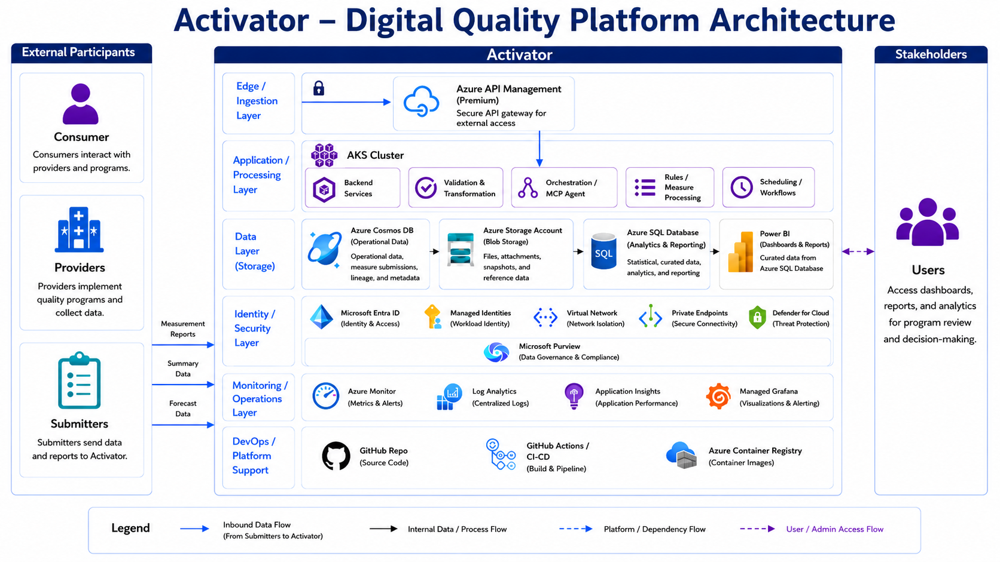

# Activator Solution Architecture

The Activator solution architecture describes how external participants, application services, data services, security controls, monitoring, and DevOps capabilities work together to support digital quality workflows.

Activator receives measurement reports, summary data, and forecast data from external participants through a secure edge layer. Azure API Management protects external access and routes requests into AKS-hosted processing services. Backend services, validation and transformation components, orchestration agents, rules processing, and workflow scheduling handle the application processing path. Operational data is stored in Azure Cosmos DB, supporting files and reference data are stored in Azure Storage, curated analytics data is stored in Azure SQL Database, and Power BI provides dashboards and reports for stakeholders.

The architecture also includes Microsoft Entra ID, managed identities, virtual networking, private endpoints, Microsoft Defender for Cloud, and Microsoft Purview for identity, security, network isolation, threat protection, and data governance. Azure Monitor, Log Analytics, Application Insights, and Managed Grafana provide observability across the platform. GitHub, GitHub Actions, and Azure Container Registry support source control, CI/CD, and container image management.

## Architecture layers

| Layer | Description |
| --- | --- |
| Edge and ingestion | Secures external access through Azure API Management. |
| Application and processing | Runs backend services, validation, orchestration, rules processing, and scheduling in AKS. |
| Data storage | Stores operational data, files, curated analytics data, and reporting datasets. |
| Identity and security | Provides identity, workload identity, network isolation, private connectivity, threat protection, and governance. |
| Monitoring and operations | Centralizes metrics, logs, application telemetry, visualization, and alerting. |
| DevOps and platform support | Manages source code, build pipelines, and container images. |
