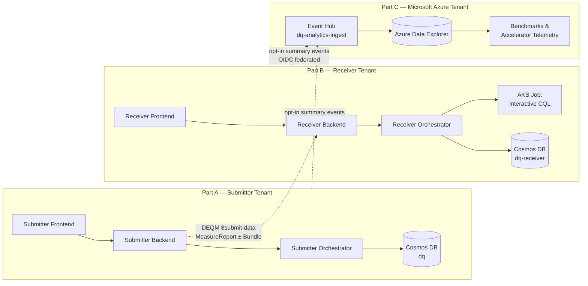
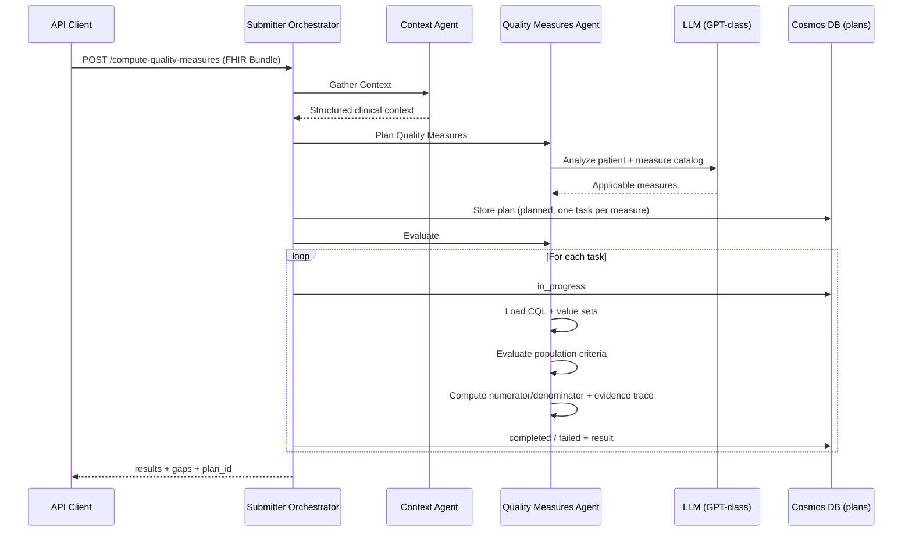
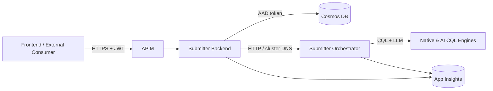
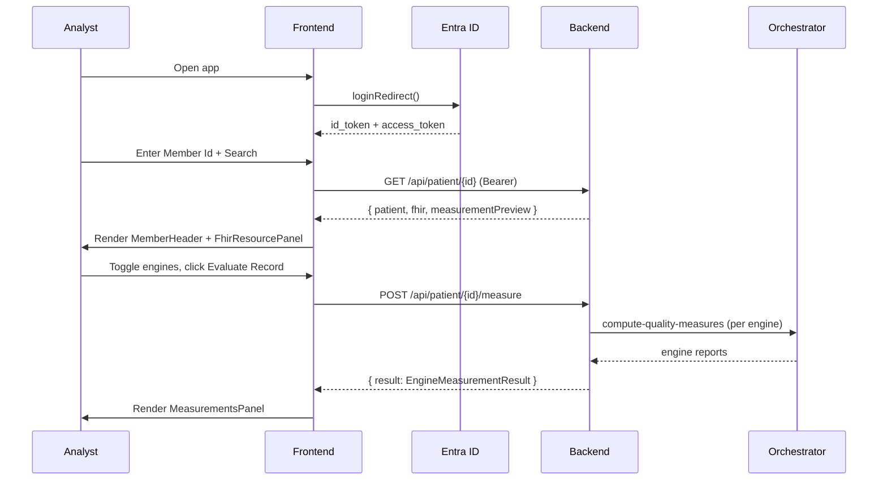
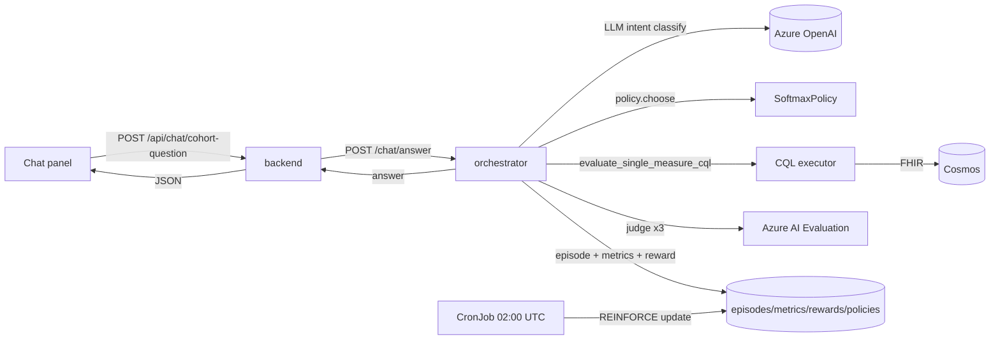
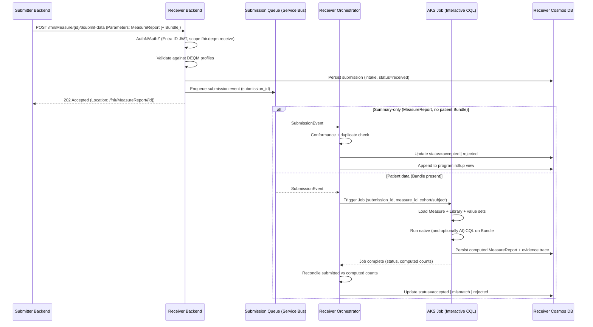
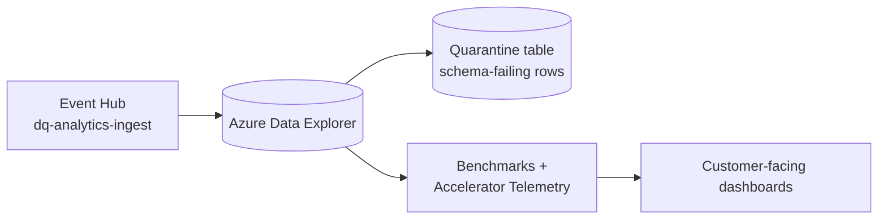

# Specification — Azure Healthcare Digital Quality

> **Companion:** [CONSTITUTION.md](./CONSTITUTION.md) — non‑negotiable platform principles.
>
> **Scope.** A consolidated technical specification for the Azure Healthcare
> Digital Quality accelerator. It replaces the four prior `.speckit/`
> documents (`spec_backend.md`, `spec_frontend.md`, `spec_orchestrator.md`,
> `spec_chat_rl.md`) and is organized around the three actors in the
> end‑to‑end quality measurement value chain:
>
> - **Part A — Submitters** (payers, ACOs, SaaS quality vendors).
> - **Part B — Receivers** (regulatory agencies, third‑party intermediaries
>   such as Inovalon and Cotiviti).
> - **Part C — Microsoft** (the accelerator publisher and benchmark host;
>   opt‑in recipient of cross‑tenant analytics).
>
> Da Vinci DEQM (FHIR R4) conformance —
> [https://build.fhir.org/ig/HL7/davinci-deqm/en/](https://build.fhir.org/ig/HL7/davinci-deqm/en/)
> — is implemented on both Submitter and Receiver sides; the operation matrix
> appears once in §1 and is referenced from the relevant Part.

---

## Table of Contents

1. [Overview](#1-overview)
2. [Part A — Submitters](#part-a--submitters)
3. [Part B — Receivers](#part-b--receivers)
4. [Part C — Microsoft](#part-c--microsoft)
5. [Dual-Stack Implementation Plan](#5-dual-stack-implementation-plan)
6. [Glossary](#6-glossary)

---

## 1) Overview

### 1.1) Mission

Enable digital quality measurement (dQM) workflows that are policy-aligned,
clinically and operationally useful, technically reproducible, and secure and
compliant by default — per [CONSTITUTION.md](./CONSTITUTION.md).

### 1.2) Actors

| Actor | Examples | Primary action |
|---|---|---|
| **Submitter** | Payers, ACOs, SaaS quality-reporting vendors | Compute measure results (numerator/denominator) per cohort/patient, then **send** to a Regulatory Agency Program — either as a measure-summary `MeasureReport` or as the underlying patient `Bundle`. |
| **Receiver** | CMS, state HIEs, Inovalon, Cotiviti | **Accept** submissions of measure summaries or patient bundles; on patient data, trigger interactive CQL processing for the cohort/patient; on summaries, validate and persist for program rollup. |
| **Microsoft** | Accelerator publisher | Operate the accelerator codebase. Receive **opt-in, summary-only, PHI-free** analytics from Submitter and Receiver tenants. Publish anonymized benchmarks and accelerator telemetry. |

Within Submitter and Receiver, the same domain personas apply: Policy Owner /
Measure Steward, Analyst, Implementation Engineer, Auditor / Reviewer.

### 1.3) End-to-end capability map



The Submitter and Receiver share most code (orchestrator engines, CQL
executors, FHIR normalization, DEQM serializers). They differ in roles,
identities, and the direction of data flow.

### 1.4) Da Vinci DEQM conformance matrix

| Resource / Operation | Submitter (Producer) | Receiver (Consumer) |
|---|---|---|
| `CapabilityStatement` (`GET /fhir/metadata`) | Required | Required |
| `Measure` (read, search) | Required | Required |
| `Library` (read) | Required | Required |
| `Measure/[id]/$data-requirements` | Required | Required (advertises to submitters) |
| `Measure/[id]/$collect-data` | Required | Optional |
| `Measure/[id]/$submit-data` | Required (initiate) | **Required (intake)** |
| `Measure/[id]/$evaluate-measure` | Required | Required (recompute) |
| `MeasureReport` (read, search) | Required | Required |

**Base URL:** `/fhir`. Content type: `application/fhir+json; fhirVersion=4.0`.

#### 1.4.1) `$data-requirements`

- **URL**: `GET|POST /fhir/Measure/{id}/$data-requirements`
- **In**: `periodStart` (date, optional), `periodEnd` (date, optional)
- **Out**: `return` (`Library`) — a `module-definition` Library whose
  `dataRequirement[]` enumerates every FHIR resource type, profile, and code
  filter the measure relies on.
- **Behavior**:
  1. Locate `Measure/{id}` in the measure repository. Return 404 +
     `OperationOutcome` if missing.
  2. Resolve each `Measure.library` reference; load ELM/CQL.
  3. Extract `dataRequirement` entries; aggregate across libraries;
     de-duplicate.
  4. Echo `periodStart`/`periodEnd` into `Library.effectivePeriod` if
     supplied.
  5. Cacheable per `(measureId, periodStart, periodEnd)` for 5 minutes.

Example request:

```http
POST /fhir/Measure/CMS165v9/$data-requirements HTTP/1.1
Content-Type: application/fhir+json
Authorization: Bearer <token>

{
  "resourceType": "Parameters",
  "parameter": [
    {"name": "periodStart", "valueDate": "2025-01-01"},
    {"name": "periodEnd",   "valueDate": "2025-12-31"}
  ]
}
```

Example response (abridged):

```json
{
  "resourceType": "Library",
  "status": "active",
  "type": {
    "coding": [{
      "system": "http://terminology.hl7.org/CodeSystem/library-type",
      "code": "module-definition"
    }]
  },
  "effectivePeriod": { "start": "2025-01-01", "end": "2025-12-31" },
  "relatedArtifact": [
    { "type": "depends-on", "resource": "Measure/CMS165v9" }
  ],
  "dataRequirement": [
    { "type": "Patient", "profile": ["http://hl7.org/fhir/us/core/StructureDefinition/us-core-patient"] },
    { "type": "Encounter", "mustSupport": ["status","class","period","type"] },
    { "type": "Condition", "codeFilter": [{"path":"code","valueSet":"…hypertension…"}] },
    { "type": "Observation", "codeFilter": [{"path":"code","valueSet":"…blood-pressure…"}] },
    { "type": "Procedure", "codeFilter": [{"path":"code","valueSet":"…dialysis-kidney-transplant…"}] }
  ]
}
```

#### 1.4.2) `$collect-data`, `$submit-data`, `$evaluate-measure`

| Operation | Method | Purpose |
|---|---|---|
| `Measure/{id}/$collect-data` | GET, POST | Return a `Bundle` satisfying `dataRequirement[]` for a subject/period. |
| `Measure/{id}/$submit-data` | POST | Accept `Parameters` containing a `MeasureReport` + optional evidence `Bundle`. Submitter initiates; Receiver intakes. |
| `Measure/{id}/$evaluate-measure` | GET, POST | Compute a `MeasureReport`. Delegates to orchestrator (native / AI). |

`$evaluate-measure` parameters:

- `periodStart` (date, required)
- `periodEnd` (date, required)
- `subject` (string, optional) — `Patient` logical id or `Group/{id}`
- `reportType` (code, optional) — `individual` | `subject-list` | `population`
- **Extension** in `Parameters.parameter`: `engine` (code) —
  `native-cql` | `ai-cql` (default follows UI toggles).

Returns a `MeasureReport` (`type = individual | summary`) with
`evaluatedResource[]` linking back to evidence items satisfying each
population criterion.

#### 1.4.3) Identifier & versioning

- `Measure.url` = `https://accelerator.local/fhir/Measure/{id}` (submitter)
  or `https://receiver.local/fhir/Measure/{id}` (receiver).
- `Measure.version` = artifact semver. Submitter and Receiver MUST agree on
  the executed version. `$evaluate-measure` responses include
  `MeasureReport.measure` with the exact `{url}|{version}`.

#### 1.4.4) DEQM security (shared)

- Entra ID JWT validation on every DEQM route.
- Scopes:
  - `fhir.deqm.read` — `$data-requirements`, `$collect-data`,
    `GET MeasureReport`.
  - `fhir.deqm.write` — `$submit-data` (Submitter initiating).
  - `fhir.deqm.receive` — `$submit-data` (Receiver intake).
  - `fhir.deqm.evaluate` — `$evaluate-measure`.
- APIM rate limits: 60 rpm per client for `$evaluate-measure`; 300 rpm
  otherwise; 30 rpm for `$submit-data` per submitter.

#### 1.4.5) Cohort roster exchange (Da Vinci ATR FHIR Group)

Quality-measurement **cohorts** are exchanged as standards-based FHIR **`Group`**
resources aligned with the **Da Vinci Member Attribution List (ATR)** `atr-group`
profile, rather than a proprietary cohort payload. The same `Group` is referenced
as `MeasureReport.subject` by the `subject-list` and `summary` DEQM profiles.

- `GET  /api/workbench/cohorts/{cohortId}/Group` — export a cohort as an
  ATR-aligned `Group` (submitters **and** receivers).
- `POST /api/workbench/cohorts/$import-group` — create/update a cohort from a
  `Group` roster (inverse).

Roster members are `Group.member[].entity` = `Reference(Patient/{id})`; in-scope
measures are carried as `Group.characteristic[].valueReference` → `Measure`.
See [`openapi/cohort-group-exchange.openapi.yaml`](openapi/cohort-group-exchange.openapi.yaml)
for the contract and [`DEQM_DAVINCI_ATR_GAP_ANALYSIS.md`](DEQM_DAVINCI_ATR_GAP_ANALYSIS.md)
for the capability-statement mapping and documented ATR conformance gaps.

### 1.5) CMS Quality Measure starting set (shared)

| Category | Measure |
|---|---|
| Universal Foundation | Controlling High Blood Pressure (CMS165v9 / NQF 0018) |
| Shared Savings Program (SSP) | Diabetes HbA1c Poor Control (>9%) — CMS122v11 |
| Hospital Quality Reporting (HQR) eCQM | Severe Obstetric Complications — ePC‑02 |

Both Submitter and Receiver consume the same measure repository layout:

```
measures/
  CMS165v9/
    measure.json        # FHIR Measure
    library.json        # FHIR Library (CQL + ELM)
    measure.cql         # Human-authored CQL
    valuesets/*.json    # Required value sets
    measure.md          # Authored narrative (AI engine input)
```

The DEQM endpoints and the orchestrator native engine MUST never diverge on
measure versions.

### 1.6) Control plane integration (shared)

| Component | Azure Service | Integration |
|---|---|---|
| API Gateway | Azure API Management | MCP façade + policies |
| Agent Runtime | Azure Kubernetes Service | Workload identity |
| Short-Term Memory | Cosmos DB | Session state |
| Long-Term Memory | Azure AI Search | Semantic search |
| Orchestration | Azure AI Foundry | Agent Service |
| Identity | Microsoft Entra ID | Agent Identity |
| Observability | Azure Monitor + App Insights | OpenTelemetry |

### 1.7) System behaviors (must be true on both sides)

1. **Deterministic scoring** — measure outputs are reproducible from the same
   inputs.
2. **Explainability** — every computed result links to evidence and rule
   trace.
3. **No speculative policy** — agents may summarize policy but must not
   invent it.
4. **Separation of duties** — policy artifact updates require approval and
   are immutable once promoted.
5. **No PHI** in logs, prompts, telemetry, or analytics envelopes.

---

## Part A — Submitters

> **Audience:** Payers, ACOs, SaaS quality-reporting vendors that compute
> measure results and submit them upstream.

> Stack reuse note. The Submitter backend skeleton described in this part
> (the `/api/patient/*`, `/api/clinical/*`, `/api/diagnostic/*` surface plus
> the mounted `/fhir`, `/api/workbench`, and `/api/chat` routers) is the
> shared FastAPI skeleton used by every stack in the repo
> (`providers/backend`, `consumers/backend`, `submitters/backend`,
> `receivers/backend`, `platform/backend`). Providers and Consumers add the
> SOAP-notes and sample-patients routers. Only `submitters/orchestrator/`
> and `receivers/orchestrator/` ship an orchestrator service. The
> Submitter-specific behavior described below (DEQM as Producer, Cohort
> Chat with RL, Submit to Agency) runs on the Submitters stack today.

### A.1) Submitter Orchestrator

#### A.1.1) Purpose

Given a measure policy package, a cohort/population context, and FHIR R4
evidence (Patient, Encounter, Condition, Observation, Procedure, Coverage),
the Submitter Orchestrator:

- extracts and normalizes FHIR resources from a Bundle or individual lists,
- uses a language model to identify which CMS quality measures apply,
- loads the corresponding measure definitions (CQL + markdown specs),
- evaluates each applicable measure against the patient's evidence,
- produces an explainability bundle with evidence traces per clause,
- emits care-gap signals for incomplete or missing evidence.

#### A.1.2) Scope (MVP)

**In scope**

1. Authoritative policy package ingestion (store and version CQL, value sets,
   metadata).
2. Measure execution (deterministic scoring via CQL and/or deterministic
   Python equivalents).
3. Explainability and audit trail (evidence bundles per clause).
4. Feedback signals (care-gap signals and closure events).

**Out of scope (for MVP)**

- UI productization beyond reference dashboards.
- National program operationalization (multi-tenant) beyond reference
  patterns.
- Automated policy authoring (only assisted workflows).

#### A.1.3) Inputs / outputs

**Inputs**

- Measure policy artifacts (versioned).
- Clinical evidence (FHIR resources) or normalized measure-ready extracts.
- Cohort / attribution inputs (where applicable).

**Data sources**

| Source | Type | Refresh Rate | Purpose |
|---|---|---|---|
| Member Clinical Context | FHIR/HL7 | Near real-time | Health status, conditions |
| Claims Data | EDI 837/835 | Daily | Service history, gaps |
| Quality Measures | HEDIS / CMS specs | Quarterly | Measure compliance |
| Provider Attribution | Roster | Weekly | Care team assignment |
| Social Risk Indicators | SDOH | Monthly | Risk stratification |
| Action Effectiveness | Analytics | Weekly | Intervention success rates |

**Outputs**

- Measure results (numerator / denominator / exclusions).
- Explainability artifact per subject (evidence + rule trace).
- Aggregate reporting outputs (program views).
- Care-gap signals and closure events.

#### A.1.4) Multi-agent decomposition

```
┌─────────────────────────────────────────────────────────────────────┐
│               Digital Quality Orchestrator Agent                    │
│         Owns end-to-end quality measure workflow                    │
└────────────────────┤────────────────────────────────────────────────┘
                     │
    ┌────────────────┤
    ▼                ▼
┌─────────┐   ┌──────────────────┐
│ Context │   │ Quality Measures │
│  Agent  │   │     Agent        │
└─────────┘   └──────────────────┘
```

| Agent | Responsibility |
|---|---|
| Digital Quality Orchestrator | End-to-end quality measure workflow coordination |
| Context Agent | Gather and normalize member/patient FHIR data |
| Quality Measures Agent | Plan applicable measures (LLM) and evaluate them |

| Step | Agent | Action |
|---|---|---|
| 1 | Context Agent | Extract and normalize FHIR resources from input |
| 2 | Quality Measures Agent | LLM identifies which measures apply |
| 2b | Orchestrator | Persist plan to Cosmos as `planned` tasks |
| 3 | Quality Measures Agent | For each task: `in_progress` → evaluate → `completed` / `failed` |

#### A.1.5) MCP Tool Catalog

| Tool | Description | Input Schema |
|---|---|---|
| `gather_context` | Extract and normalize FHIR resources | `{ fhir_bundle, patient, ... }` |
| `plan_quality_measures` | LLM identifies applicable measures | `{ patient_summary, measure_catalog[] }` |
| `evaluate_quality_measures` | Evaluate identified measures | `{ measures[], fhir_context, measurement_period }` |
| `get_plan` | Retrieve a plan + task statuses | `{ plan_id }` |
| `get_measure_definition` | CQL + markdown for a measure | `{ measure_id }` |
| `get_member_context` | Member clinical / risk context | `{ member_id }` |

#### A.1.6) Workflow



#### A.1.7) Quality Engine Toggle requirements

1. The UI exposes two right-aligned toggles above `Switch Patient`:
   - `Native CQL Engine` (default `on`)
   - `AI CQL Engine` (default `off`)
2. Toggle state is passed frontend → backend → orchestrator on every
   quality-measure execution request.
3. If Native is enabled, `digital_quality_measures.py` evaluates via
   `digital_quality_measures_native_cql_executor.py`.
4. If AI is enabled, `digital_quality_measures.py` evaluates via
   `digital_quality_measures_lm_cql_executor.py`.
5. LLM planning/evaluation logic lives in
   `digital_quality_measures_lm_cql_executor.py`; orchestration stays in
   `digital_quality_measures.py`.
6. The MVP catalog contains three measures in `measures/`; all three are
   executed per patient request.
7. Native engine evaluates `*.cql` artifacts; AI engine evaluates `*.md`
   artifacts.

#### A.1.8) Testing & evaluation

| Layer | Coverage Target |
|---|---|
| Context gathering | 90% |
| Measure planning | 90% |
| Measure evaluation | 95% |
| MCP protocol | 100% |

| Evaluation | Framework | Threshold |
|---|---|---|
| Intent Resolution | Azure AI Foundry IntentResolutionEvaluator | > 4.0 / 5.0 |
| Tool Call Accuracy | ToolCallAccuracyEvaluator | > 3.0 / 5.0 |
| Task Adherence | TaskAdherenceEvaluator | 0 flagged |
| Groundedness | GroundednessEvaluator | > 3.0 / 5.0 |
| Relevance | RelevanceEvaluator | > 3.0 / 5.0 |
| Content Safety | Azure Content Safety | 0 violations |

#### A.1.9) KPIs

| Class | Metric | Target |
|---|---|---|
| Operational | Care Gap Closure Rate | +15% vs baseline |
| Operational | Time-to-Action | < 24 hours |
| Operational | Outreach Effectiveness | > 30% engagement |
| Operational | Cost per Closed Gap | -20% vs baseline |
| Quality | HEDIS Attainment | > 4 STARS |
| Quality | Scoring Accuracy | > 0.80 AUC |
| Technical | API Latency P95 | < 500 ms |
| Technical | Availability | 99.9% |

#### A.1.10) Acceptance criteria

1. Can ingest and version at least one policy package per §1.5 category.
2. Can execute those measures deterministically over sample evidence.
3. Produces an explainability artifact listing measure version, inputs,
   clauses satisfied, and evidence per clause.
4. Produces care-gap signals for incomplete/missing evidence.

---

### A.2) Submitter Backend

#### A.2.1) Purpose

The Submitter Backend is the **API façade** and **orchestration bridge**:

1. Authenticates callers (Entra ID JWT).
2. Serves patient, clinical, and measurement data from Cosmos DB (SQL API).
3. Brokers requests to the Submitter Orchestrator for native and AI CQL
   execution.
4. Exposes FHIR R4 DEQM operations (`$data-requirements`, `$collect-data`,
   `$submit-data` *initiate*, `$evaluate-measure`).
5. Emits OpenTelemetry to Azure Monitor / App Insights.

#### A.2.2) Non-goals

- UI rendering (handled by frontend).
- Measure authoring (upstream).
- Acting as a full FHIR server.

#### A.2.3) Runtime & topology

| Concern | Choice |
|---|---|
| Language / runtime | Python 3.11 |
| Web framework | FastAPI + Uvicorn/Gunicorn (`fastapi[standard]`) |
| Container | Linux container |
| Orchestrator | Azure Kubernetes Service |
| Inbound identity | Entra ID JWT bearer |
| Outbound identity | Workload identity → managed identity |
| Data store | Cosmos DB for NoSQL (SQL API) |
| Telemetry | OpenTelemetry → Azure Monitor / App Insights |
| Inter-service | HTTP via in-cluster DNS |



#### A.2.4) Configuration

| Variable | Purpose | Required |
|---|---|---|
| `COSMOSDB_DATABASE` | Cosmos database (default `dq`) | Yes |
| `COSMOSDB_CATALOG_COLLECTION` | Catalog container | Yes |
| `COSMOSDB_COHORTS_COLLECTION` | Cohorts container | Yes |
| `COSMOS_ENDPOINT` / `COSMOSDB_ENDPOINT` | AAD-auth endpoint | Yes* |
| `COSMOSDB_USERNAME` / `COSMOSDB_PASSWORD` / `COSMOSDB_HOST` | Legacy key mode | Yes* |
| `REQUIRE_DATABASE` | Fail fast if Cosmos unavailable | No |
| `SAMPLE_DATA_DIR` | Local fallback FHIR bundles | No |
| `DIGITAL_QUALITY_ORCHESTRATOR_BASE_URL` | Orchestrator URL | Yes |
| `DIGITAL_QUALITY_ORCHESTRATOR_QUALITY_ENDPOINT` | Defaults `/tools/compute-quality-measures` | No |
| `DIGITAL_QUALITY_ORCHESTRATOR_TIMEOUT_SECONDS` | Native engine timeout | No |
| `DIGITAL_QUALITY_ORCHESTRATOR_AI_TIMEOUT_SECONDS` | AI engine timeout | No |
| `AZURE_TENANT_ID`, `AZURE_CLIENT_ID` | Entra ID app identity | Yes |
| `APPINSIGHTS_CONNECTIONSTRING` | OTel exporter | No |
| `API_SERVICE_ACA_URI`, `WEB_SERVICE_ACA_URI` | CORS origins | No |

*Either AAD-endpoint mode OR legacy key mode must be provided.

#### A.2.5) Security

1. **Inbound auth** — every `/api/**` and `/fhir/**` route validates an
   Entra ID JWT via `auth_middleware.py`. Signature, expiration, issuer, and
   audience checked; JWKS cached for 1 hour.
2. **Outbound auth** — Cosmos prefers `DefaultAzureCredential`; key auth only
   when explicitly supplied.
3. **CORS** — origins from `origins.txt` or Codespaces env; wildcard only in
   local dev.
4. **No PHI** — FHIR bundles must not be copied into logs, prompts, or
   spans. Telemetry decorators redact payloads.
5. **Least privilege** — managed identity holds `Cosmos DB Built-in Data
   Contributor` only.

#### A.2.6) API surface — Submitter APIs

The backend mounts three sets of routes:

| Method | Path | Purpose |
|---|---|---|
| GET | `/` | Liveness (public) |
| GET | `/api/patient/{id}` | Read patient summary + latest measurement |
| POST | `/api/patient` | Upsert patient summary |
| POST | `/api/clinical/patients` | Upsert raw FHIR bundle / clinical record |
| GET | `/api/clinical/patients/{id}` | Read clinical record |
| POST | `/api/summarize` | AI narrative summary of a patient (non-authoritative) |
| POST | `/api/patient/{id}/measure` | Evaluate configured measures for a patient |
| POST | `/api/diagnostic/case` | Create a diagnostic case |
| GET | `/api/diagnostic/case/{case_id}/summary` | Case summary |
| GET | `/api/diagnostic/case/{case_id}/traces` | Case tracing events |
| GET | `/api/diagnostic/case/{case_id}/agent-messages` | Case agent messages |

The Quality Measures Workbench router is mounted at `/api/workbench` (see `submitters/backend/src/workbench.py`):

| Method | Path | Purpose |
|---|---|---|
| GET/POST/PATCH/DELETE | `/api/workbench/catalog/measures[/{id}]` | Measure catalog CRUD |
| POST | `/api/workbench/catalog/measures/{id}/sample-data` | Attach sample FHIR bundles to a measure |
| GET/POST/DELETE | `/api/workbench/catalog/tags[/{tag_id}]` | Tag CRUD |
| GET/POST/DELETE | `/api/workbench/catalog/agencies[/{agency_id}]` | Regulatory agency + program CRUD |
| GET/POST/DELETE | `/api/workbench/cohorts[/{cohort_id}]` | Cohort CRUD |
| POST | `/api/workbench/cohorts/{cohort_id}/members` | Add a member (FHIR `Bundle`) to a cohort |
| GET | `/api/workbench/members` | Member lookup |
| GET/POST | `/api/workbench/submissions[/{submission_id}]` | Submission records |
| POST | `/api/workbench/submissions/process` | Process a pending submission |

The Cohort Chat router is mounted at `/api/chat`:

| Method | Path | Purpose |
|---|---|---|
| POST | `/api/chat/cohort-question` | Ask a canned cohort-quality question (forwarded to orchestrator) |
| GET | `/api/chat/episodes/{episode_id}/reward` | Poll the shaped reward for a chat episode |

The Providers and Consumers stacks additionally mount the SOAP-notes router (`/api/patients/{id}/soap-notes`) and the sample-patients router (`/api/sample-patients`) from `soap_notes.py` and `sample_patients.py`.

##### Measure execution request

```json
{
  "mode": "non-cql | cql",
  "engines": {
    "useNativeCqlEngine": true,
    "useAiCqlEngine": false
  }
}
```

The backend calls the orchestrator's `/tools/compute-quality-measures` per
enabled engine **in parallel**, merges results, and persists a
`measurement_execution` record keyed by patient id.

#### A.2.7) API surface — DEQM (Submitter as Producer)

The DEQM router is mounted at `/fhir` by `submitters/backend/src/deqm.py`. It exposes the operations in §1.4 in the Producer role, plus a small read-only registry for `Measure` / `Library` artifacts, and initiates `$submit-data` calls against Receiver endpoints (see §B.2.5).

| Operation | Method | Required scope |
|---|---|---|
| `GET /fhir/metadata` | GET | (public) |
| `GET /fhir/Measure` | GET | `fhir.deqm.read` |
| `GET /fhir/Measure/{id}` | GET | `fhir.deqm.read` |
| `GET /fhir/Library/{id}` | GET | `fhir.deqm.read` |
| `GET/POST /fhir/Measure/{id}/$data-requirements` | GET/POST | `fhir.deqm.read` |
| `GET/POST /fhir/Measure/{id}/$collect-data` | GET/POST | `fhir.deqm.read` |
| `POST /fhir/Measure/{id}/$submit-data` | POST | `fhir.deqm.write` |
| `GET/POST /fhir/Measure/{id}/$evaluate-measure` | GET/POST | `fhir.deqm.evaluate` |
| `GET /fhir/MeasureReport/{id}` | GET | `fhir.deqm.read` |

#### A.2.8) Data contracts — Cosmos DB

All workbench data lives in the `dq` database. Containers are partitioned by
`/docType`:

| Container | Partition Key | docType values | Contents |
|---|---|---|---|
| `catalog` | `/docType` | `measure` | FHIR `Measure` skeleton + workbench metadata |
| `catalog` | `/docType` | `tag` | User-defined tags |
| `catalog` | `/docType` | `agency` | Regulatory agencies / programs + reporting periods |
| `cohorts` | `/docType` | `cohort` | Cohort definitions |
| `cohorts` | `/docType` | `member` | FHIR `Bundle` per patient |
| `cohorts` | `/docType` | `measurement_execution` | Per-member measurement run records |
| `cohorts` | `/docType` | `measure_report` | Persisted DEQM `MeasureReport` + evidence |
| `cohorts` | `/docType` | `submission` | Outbound DEQM `$submit-data` payloads (record of what we sent) |
| `tenant_settings` | `/docType` | `tenant_setting` | Includes opt-in analytics consent (§4.3) |

The legacy `clinical` and `mcpdb` databases are retired.

#### A.2.9) Observability

- Every request annotated with `measure.id`, `measure.version`, `engine`,
  `plan.id`, `case.id`, `subject.hash` (SHA-256 of MRN, **not** MRN).
- DEQM emits per-phase spans: `dataRequirements.load`,
  `dataRequirements.aggregate`, `evaluate.native`, `evaluate.ai`,
  `submitData.persist`, `submitData.send` (outbound to Receivers).
- Metrics: `deqm.evaluate.duration_ms`, `deqm.evaluate.errors_total`,
  `deqm.dataRequirements.cache_hits_total`,
  `deqm.submitData.outbound_total{receiver_id,outcome}`.

#### A.2.10) Acceptance criteria

1. All existing `/api/**` routes pass integration tests.
2. `GET /fhir/metadata` returns a `CapabilityStatement` listing the four
   DEQM operations and supported profiles.
3. `$data-requirements` returns a `Library` (`module-definition`) whose
   `dataRequirement[]` is byte-identical (after sort/de-dup) to what the
   native engine uses.
4. `$evaluate-measure` produces a `MeasureReport` whose
   numerator/denominator/exclusion counts equal those from the existing
   `/api/patient/{id}/measure` for the same subject.
5. Outbound `$submit-data` against a Receiver returns `202 Accepted` and is
   recorded in the Submitter's `submissions` container with the Receiver's
   `Location` header preserved.
6. No PHI appears in logs, spans, or AI prompts (verified by redaction
   tests).
7. All DEQM routes enforce JWT + scopes (§1.4.4).

#### A.2.11) Testing

| Layer | Coverage | Notes |
|---|---|---|
| Unit — DEQM serializers | ≥ 95% | `Library`, `MeasureReport`, `Parameters` round-trip |
| Unit — `dataRequirement` aggregation | ≥ 95% | Sort + de-dup determinism |
| Contract — HL7 DEQM IG | 100% | Validate each response against published FHIR profiles |
| Integration — `$evaluate` vs `/api/measure` | Must match | Golden fixtures in `_evals/baseline_cases/` |
| Security | 100% | JWT + scope enforcement per route |
| Performance | p95 | `$data-requirements` < 200 ms cached / < 500 ms cold; `$evaluate-measure` < 2 s native, < 20 s AI |

---

### A.3) Submitter Frontend

#### A.3.1) Purpose

The Submitter Frontend is the **analyst workstation**:

1. Entra ID sign-in (MSAL Browser + React).
2. Member Search to retrieve a patient's normalized FHIR view.
3. Member Header showing identity, demographics, and engine toggles.
4. FHIR Resource Panel rendering Encounters, Conditions, Observations,
   Procedures, and Coverage.
5. Measurements Panel that triggers `/api/patient/{id}/measure` and renders
   native and AI engine reports side by side with evidence traces and gaps.
6. **Cohort Chat** panel with reinforcement learning (§A.4).
7. **Submit to Agency** action that initiates DEQM `$submit-data` against a
   configured Receiver.
8. **Settings → Analytics** opt-in toggle (§4.3).

It MUST NOT:

- Embed PHI in telemetry, logs, or storage keys.
- Invent measure logic or alter measure versions.
- Treat AI-engine output as authoritative.

#### A.3.2) Runtime & topology

| Concern | Choice |
|---|---|
| Language | TypeScript 5.x |
| UI library | React 18 |
| Bundler | Vite 6 |
| Styling | Tailwind CSS 3 + custom `patient.css` |
| State | Redux Toolkit |
| Auth | `@azure/msal-browser` + `@azure/msal-react` |
| HTTP | Native `fetch` (axios available for uploads) |
| Build artifact | Static assets served by Nginx |
| Container | Nginx 1.x, port 80 |
| Orchestrator | AKS |

Nginx serves the SPA (`try_files $uri $uri/ /index.html`) and proxies
`/api/*` to `http://backend.dq.svc.cluster.local/api/`. No client-to-backend
CORS dependency in production.

#### A.3.3) Configuration

| Variable | Purpose | Required |
|---|---|---|
| `VITE_AZURE_CLIENT_ID` | App registration | Yes |
| `VITE_AZURE_AUTHORITY` | e.g. `https://login.microsoftonline.com/{tenant}` | Yes |
| `VITE_AZURE_REDIRECT_URI` | SPA redirect | Yes |
| `VITE_AZURE_DOMAIN_HINT` | Login domain hint | No |
| `VITE_API_SCOPE` | API scope for bearer tokens | Yes |
| `VITE_API_URL` | Override API base (local dev) | No |
| `VITE_CLINICAL_STAFF_GROUP_ID` | Entra group gate | Yes |
| `VITE_ADMIN_GROUP_ID` | Entra group gate | Yes |

#### A.3.4) Security

1. MSAL with Authorization Code + PKCE. `localStorage` token cache;
   `storeAuthStateInCookie: true`; `clientCapabilities: ["CP1"]`.
2. Bearer token attached on every `/api/**` call; missing token throws
   before any network call.
3. 401 triggers `acquireTokenPopup`; persistent failure surfaces "Authentication
   failed. Please log in again."
4. Group gating via `VITE_CLINICAL_STAFF_GROUP_ID` and `VITE_ADMIN_GROUP_ID`
   from id-token `groups` claim.
5. No MRN or patient name in `console.*` or `localStorage` keys.
6. Debug blocks default off in production.
7. Backend errors mapped to generic UX messages.
8. HTTPS only at ingress.
9. Nginx blocks caching of `index.html`; hashed asset bundles cached.

#### A.3.5) Application shell

Entry is `src/App.tsx`, wrapped in `ErrorBoundary` + MSAL provider.

| State | Rendered |
|---|---|
| Unauthenticated | `LoginComponent` |
| Authenticated | Header + `Patient` + version footer |

Redux store tracks `patient.patients[]`, `currentPatient`, and `current`.
Transient UI state (`searchId`, `measurementResult`, engine toggles,
`loading`, `error`) lives in local `useState`.

#### A.3.6) Primary workflow — evaluate quality measures



#### A.3.7) Components

| Component | Responsibility |
|---|---|
| `App.tsx` | Shell, auth gating, version footer |
| `LoginComponent.tsx` | Sign-in CTA |
| `UserProfile.tsx` | Signed-in user chip + logout |
| `ErrorBoundary.tsx` | Top-level React error fallback |
| `patient.tsx` | Search form + page composition |
| `MemberHeader.tsx` | Demographics + Switch Patient + engine toggles + Evaluate |
| `FhirResourcePanel.tsx` | Encounter/Condition/Observation/Procedure/Coverage |
| `MeasurementsPanel.tsx` | Per-engine `QualityEngineReport` + summary |
| `CohortsPage.tsx` | Cohort browsing, Evaluate, Chat, Submit to agency |
| `CohortChatPanel.tsx` | Cohort chat experience (§A.4) |
| `AnalyticsSettings.tsx` | Opt-in toggles for §4.3 |

#### A.3.8) API contract (frontend view)

**`GET /api/patient/{id}`**

```ts
{
  patient?: LegacyPatient,
  fhir?: FhirView,
  measurementPreview?: MeasurementResult
}
```

**`POST /api/patient/{id}/measure`**

```json
{ "use_native_cql_engine": true, "use_ai_cql_engine": false }
```

```ts
{
  patientId: string,
  hasFhirBundle: boolean,
  result: EngineMeasurementResult,
  persistedToCosmos: boolean
}
```

All requests carry `Authorization: Bearer <access_token>`.

#### A.3.9) Build, package, deploy

- `npm run dev`, `npm run build`, `npm run lint`, `npm run preview`.
- Multi-stage Dockerfile: Node build → Nginx runtime.
- `nginx/run_nginx.sh` + `env.sh` substitute `VITE_*` at container start.
- Kubernetes namespace: `dq`. Ingress exposes `/` to SPA and `/api/*` to
  backend.

#### A.3.10) Observability

- Console logs warnings/errors only in production.
- MSAL PII logging dropped.
- App Insights browser SDK not enabled today; if added, strip/hash MRN.
- Version string rendered in footer.

#### A.3.11) Acceptance criteria

1. An authenticated analyst can search a Member Id and see header + FHIR
   panel populated.
2. Native on, AI off → one call to `/api/patient/{id}/measure`; native
   engine report rendered with evidence traces.
3. Both on → side-by-side native + AI report; native renders first when
   ready.
4. No PHI in `console.*`.
5. `npm run lint` and `npm run build` pass with zero warnings.
6. Container fail-fasts on any missing required `VITE_*` variable.
7. `/api/*` from the pod routes to `backend.dq.svc.cluster.local` carrying
   the user's token unchanged.

---

### A.4) Cohort Chat with Reinforcement Learning (Submitter-only)

#### A.4.1) Purpose

Marry the numerator/denominator pipeline with a chat experience that
surveils a cohort through canned clinical questions, turning every turn into
a learning signal.

The feature MUST:

1. Be a strict superset of the existing measure-evaluation flow.
2. Persist every chat turn as an `Episode` with the exact policy version
   that produced it.
3. Be auditable end to end (action id, judge scores, reward, policy version,
   episode id stored and surfaced).
4. Degrade gracefully when Cosmos, Foundry, or the learning SDK is absent.

The feature MUST NOT:

1. Allow the LLM to author numerator/denominator math.
2. Persist free-form PHI to learning containers.
3. Hold credentials. All Azure access uses workload identity.

#### A.4.2) Non-goals (v1)

- Free-text questions; only canned questions supported.
- Multi-measure questions in a single turn.
- Real-time policy updates (nightly CronJob; explicit
  `POST /chat/policy/reload` for mid-day).
- User-visible thumbs up/down. Reward comes from judges only.

#### A.4.3) Flow

The Cohorts page gains a `Chat` button between `Evaluate measures` and
`Submit to agency`. Canned questions:

| Button label | Maps to measure |
|---|---|
| Hemoglobin A1c Poor Control? | `CMS122v11` |
| Uncontrolled High Blood Pressure? | `CMS165v9` |
| Severe Obstetric Complications? | `ePC02` |



#### A.4.4) Action space

| `action.id` | Behavior |
|---|---|
| `terse-counts` | One-sentence summary of numerator, denominator, gap count. |
| `gap-focused` | Members in care gap; lists MRNs + reason. |
| `evidence-cited` | Cites deciding clinical value per member. |
| `narrative` | Natural-language paragraph for clinician audience. |

Adding a fifth template is a one-line registration plus a template string.
Existing snapshots are preserved via `SoftmaxPolicy.from_snapshot`.

#### A.4.5) Reward shaping

```
reward = clip(
    0.40 * intent_resolution
  + 0.30 * task_adherence
  + 0.30 * task_completion
  -  0.25 * hallucinated_member_id
  -  0.15 * bad_measure_route,
  0.0, 1.0
)
```

Judge weights from SDK env (defaults):

- `AGENT_LEARNING_W_INTENT=0.4`
- `AGENT_LEARNING_W_ADHERENCE=0.3`
- `AGENT_LEARNING_W_COMPLETION=0.3`

#### A.4.6) Frontend contract

`PANEL_LABELS` in `CohortsPage.tsx` gains
`{ id: "chat", label: "Chat", help: "Ask the cohort a quality question" }`.

`CohortChatPanel.tsx`:

```ts
interface CohortChatPanelProps {
  cohortId: string;
  cohortName: string;
  memberIds: string[];
  selectedMeasureIds: string[];
  periodStart: string;
  periodEnd: string;
}
```

- Three canned-question buttons; each disabled when its measure id is not in
  `selectedMeasureIds`.
- Chat thread as alternating user/assistant blocks.
- Every assistant block shows action id and policy version in a small
  caption.
- `(reward pending)` pill resolves to a numeric reward via polling every 2 s
  for up to 30 s.

`cohortChat.ts` exposes `askCohortQuestion`, `fetchReward`. No direct
browser calls to orchestrator.

#### A.4.7) Backend contract

**`POST /api/chat/cohort-question`**

```json
{
  "cohort_id": "controlled-diabetes-2024",
  "question": "Hemoglobin A1c Poor Control?",
  "measure_id": "CMS122v11",
  "period_start": "2024-01-01",
  "period_end": "2024-12-31"
}
```

The backend resolves `cohort.memberIds` server-side from Cosmos using the
authenticated caller's tenant filter. The browser MUST NOT supply member
ids.

Response: orchestrator response verbatim.

Auth: `current_user: Dict = Depends(get_current_user_conditional)`.

**`GET /api/chat/episodes/{episode_id}/reward`**

```json
{
  "episode_id": "ep-...",
  "reward": 0.78,
  "judges": {
    "intent_resolution": 0.9,
    "task_adherence": 0.7,
    "task_completion": 0.7
  },
  "penalties": { "hallucinated_member_id": 0, "bad_measure_route": 0 }
}
```

Backend forwards to orchestrator over in-cluster DNS at
`http://orchestrator.dq.svc.cluster.local:8000`. Timeout 60 s. Orchestrator
failure → 502 with stable error envelope.

#### A.4.8) Orchestrator contract

**`POST /chat/answer`**

Request:

```json
{
  "agent_id": "dq",
  "cohort_id": "controlled-diabetes-2024",
  "member_ids": ["p-cms122-001"],
  "selected_measure_ids": ["CMS122v11"],
  "question": "Hemoglobin A1c Poor Control?",
  "period_start": "2024-01-01",
  "period_end": "2024-12-31"
}
```

Response:

```json
{
  "answer_markdown": "…",
  "measure_id": "CMS122v11",
  "policy_id": "dq",
  "policy_version": 7,
  "action_id": "gap-focused",
  "episode_id": "ep-2026-05-16-...",
  "members": [
    { "id": "p-cms122-001", "status": "complete", "numerator": 0, "denominator": 1, "notes": "HbA1c 10.2%" }
  ],
  "reward_pending": true
}
```

Internal sequence:

1. `policy.choose()` (uniform random if no snapshot) → `Decision`.
2. `learning_capture.start(...)` → `ctx`.
3. LLM intent classification (mismatch → `bad_measure_route` penalty).
4. `evaluate_single_measure_cql(...)` per member, concurrently.
5. Render answer with the action template.
6. `learning_capture.end(ctx, ...)` persists `Episode`.
7. `asyncio.create_task(grade_and_persist_reward(...))` resolves the
   pending reward.

**`POST /chat/policy/reload`** (admin) — calls
`SoftmaxPolicy.from_snapshot(store.get_latest_policy(agent_id))` and swaps
the in-process singleton. Auth: bearer with `Quality.Admin` role.

**Feature flags**

- `ENABLE_LEARNING_CAPTURE` — gates persistence of episodes.
- `ENABLE_LEARNING_POLICY` — when `false`, action forced to `terse-counts`.

Both default `false` in production until A/B evidence ships.

#### A.4.9) Cosmos DB schema (RL containers)

Created on first use by `azure-agents-learning-sdk` inside the `dq`
database. Rows keyed by `/agent_id`.

| Container | Purpose |
|---|---|
| `episodes` | One row per chat turn. |
| `metrics` | Raw per-judge scores. |
| `rewards` | Shaped scalar reward per episode. |
| `policies` | `PolicySnapshot` rows; monotonic `version`. |
| `runs` | `TrainingRun` rows; one per CronJob execution. |

#### A.4.10) Training job

`orchestrator/k8s/cronjob-rl-training.yaml` — daily 02:00 UTC, image-shared
with the orchestrator, service account `mcp-agent-sa`. Runs:

```
python -m agent_learning.cli train --agent-id dq --limit 500
```

Resources: requests `cpu 100m / mem 256Mi`; limits `cpu 500m / mem 1Gi`.
`successfulJobsHistoryLimit: 3`, `failedJobsHistoryLimit: 3`,
`concurrencyPolicy: Forbid`.

#### A.4.11) A/B harness

`_evals/healthcare_digital_quality/ab_rl_vs_baseline.py` — two arms
(`baseline`, `rl-on`), `N=200` iterations over a 9-item fixture set across
the three measures and three phrasings.

Success criteria:

1. Mean reward `rl-on - baseline >= +0.05`.
2. `task_completion` mean `rl-on - baseline >= +0.08`.
3. Policy entropy decreases monotonically.

Failure of any blocks rollout.

#### A.4.12) Telemetry

A single `chat.cohort_question` span wraps the orchestrator handler.
Attributes: `chat.action_id`, `chat.policy_id`, `chat.policy_version`,
`chat.measure_id`, `chat.episode_id`, `chat.cohort_id`, `chat.member_count`.
PHI MUST NOT appear in span attributes. Reward/judge scores recorded on a
child `chat.grade` span once grading completes.

---

## Part B — Receivers

> **Audience:** Regulatory agencies and third-party submission intermediaries
> (CMS, state HIEs, Inovalon, Cotiviti) that accept DEQM submissions and
> produce program rollups.

> Implementation status. The current `receivers/` stack ships the same
> backend skeleton as `submitters/` (the shared `/api/patient/*`,
> `/api/clinical/*`, `/api/diagnostic/*`, `/api/workbench/*`, `/api/chat/*`,
> and `/fhir/*` surface) plus a `measure_submissions` Cosmos helper for
> persisting incoming DEQM submissions, and a mirror `receivers/orchestrator/`
> with the same MCP entry points as the submitter orchestrator. The
> receiver-specific architecture described below (a dedicated
> `/api/submissions`, `/api/programs`, `/api/rollup` surface, an Azure
> Service Bus intake queue (`dq-submissions`), an AKS-job factory for
> interactive CQL processing, a physically separate `dq-receiver` Cosmos
> database, a separate APIM product, and the dedicated `intake_*` modules
> shown in §B.2.6 / §B.3.4) is the target design. It is **not implemented
> today**; this part describes the intended end-state and the migration is
> staged in §5.

### B.1) Persona and intent

A **Receiver** ingests submissions from one or many **Submitters**. The
Receiver MUST:

1. Accept a DEQM `MeasureReport` summary (numerator/denominator counts per
   cohort/patient) without the underlying clinical evidence.
2. Accept a DEQM evidence `Bundle` (the patient data itself) for one or many
   subjects.
3. On evidence-bundle submission, trigger an **AKS-based job** that performs
   **interactive CQL processing** on the cohort/patient using the same
   orchestrator engines used on the Submitter side.
4. On summary-only submission, validate and persist the `MeasureReport` for
   program rollup and reconciliation.

The Receiver MUST conform to the HL7 Da Vinci DEQM IG in the
Consumer/Receiver role.

### B.2) Receiver Backend

#### B.2.1) Runtime & topology

Same stack as the Submitter Backend (§A.2.3); separate deployment, separate
Cosmos account, separate APIM product.



#### B.2.2) FHIR DEQM intake surface

| Operation | Method | Role | Required scope |
|---|---|---|---|
| `GET /fhir/metadata` | GET | Advertise Consumer conformance | (public) |
| `POST /fhir/Measure/{id}/$submit-data` | POST | **Intake** | `fhir.deqm.receive` |
| `GET /fhir/MeasureReport/{id}` | GET | Read persisted report | `fhir.deqm.read` |
| `GET /fhir/MeasureReport?...` | GET | Search persisted reports | `fhir.deqm.read` |
| `POST /fhir/Measure/{id}/$evaluate-measure` | POST | Recompute from intake evidence | `fhir.deqm.evaluate` |
| `POST /fhir/Measure/{id}/$data-requirements` | POST | Advertise to Submitters what is required | `fhir.deqm.read` |

#### B.2.3) `$submit-data` semantics (Receiver)

- **Inputs**: `Parameters` containing exactly one `MeasureReport` and zero or
  more `Bundle` (FHIR R4). Authorization scope `fhir.deqm.receive`.
- **Validation**:
  1. `MeasureReport.measure` must reference a `Measure.url|version`
     published by the Receiver (or whitelisted in the program registry).
  2. `MeasureReport.period` must lie within the active reporting period for
     `MeasureReport.measure`.
  3. If `Bundle` resources are present, `Bundle.entry[].resource` MUST
     satisfy the `dataRequirement[]` returned by the Receiver's
     `$data-requirements` for the same measure version.
  4. Submitter identity (Entra ID `oid` claim) must be registered for the
     reporting program.
- **Response**: `202 Accepted` with `Location: /fhir/MeasureReport/{id}` and
  body `OperationOutcome` carrying the `submission_id`.
- **Idempotency**: Submitters MAY include `X-Idempotency-Key`. The Receiver
  Backend MUST de-duplicate by `(submitter_id, measure.url|version,
  reporting_period, idempotency_key)` for 24 hours.

#### B.2.4) Submission states

```
received → validated → enqueued
  ↓                       ↓
rejected             [summary] accepted | mismatch | rejected
                     [bundle]  processing → reconciled (accepted | mismatch | rejected)
```

States are stored in the Receiver's Cosmos `submissions` container.

#### B.2.5) Receiver-only operational APIs

| Method | Path | Purpose |
|---|---|---|
| GET | `/api/submissions` | List submissions (filter by submitter, measure, period, state). |
| GET | `/api/submissions/{id}` | Submission detail (states, computed counts, reconciliation). |
| GET | `/api/submissions/{id}/evidence` | Read the submitted Bundle (`fhir.deqm.read`). |
| POST | `/api/submissions/{id}/replay` | Re-trigger CQL processing (admin). |
| GET | `/api/programs` | Reporting programs (period, measures, registered submitters). |
| POST | `/api/programs/{id}/submitter` | Register a submitter (admin). |
| GET | `/api/rollup/{measureId}` | Aggregate counts by submitter for the active reporting period. |

Auth model: Entra ID JWT validation; receiver-specific roles:

- `Quality.Receiver.Read`
- `Quality.Receiver.Write`
- `Quality.Receiver.Admin`

#### B.2.6) Skeleton

```
receiver/backend/
  Dockerfile
  requirements.txt
  src/
    main.py
    auth_middleware.py
    fhir/
      submit_data_router.py
      capability_statement.py
    api/
      submissions_router.py
      programs_router.py
      rollup_router.py
    services/
      submission_queue.py
      reconciliation.py
    cosmos/
      intake_repository.py
      programs_repository.py
  k8s/
    deployment.yaml
    ingress.yaml
```

### B.3) Receiver Orchestrator

The Receiver Orchestrator is the same code base as the Submitter
Orchestrator (§A.1) with two additional modes:

| Mode | Trigger | Action |
|---|---|---|
| `intake-summary` | `summary-only` subscription | Validate `MeasureReport` against `Measure` definition; reconcile against program rollup; update submission state. |
| `intake-bundle` | `with-evidence` subscription | Create a Kubernetes `Job` (manifest below) that runs the orchestrator's native and (optionally) AI CQL executors against the submitted `Bundle`. On completion, persist the computed `MeasureReport` and reconcile against the submitted one. |

#### B.3.1) Submission queue

- Azure Service Bus topic `dq-submissions` with subscriptions:
  - `summary-only` (filter: `kind = 'summary'`)
  - `with-evidence` (filter: `kind = 'bundle'`)
- Receiver Orchestrator pulls from each subscription.
- Dead-letter queue per subscription. DLQ items surface in the Receiver
  Frontend admin view.

#### B.3.2) AKS Job — interactive CQL processing

`receiver/orchestrator/k8s/job-receiver-cql.yaml` (template):

```yaml
apiVersion: batch/v1
kind: Job
metadata:
  generateName: receiver-cql-
  namespace: dq
spec:
  ttlSecondsAfterFinished: 3600
  backoffLimit: 1
  template:
    spec:
      serviceAccountName: mcp-agent-sa
      restartPolicy: Never
      containers:
        - name: cql
          image: crpynargp3zuafw.azurecr.io/azure-healthcare-digital-quality-orchestrator:latest
          command: ["python", "-m", "receiver.run_cql"]
          args:
            - "--submission-id"
            - "$(SUBMISSION_ID)"
            - "--measure-id"
            - "$(MEASURE_ID)"
            - "--mode"
            - "interactive"
          env:
            - name: SUBMISSION_ID
              value: "<filled at job create>"
            - name: MEASURE_ID
              value: "<filled at job create>"
          resources:
            requests: { cpu: "500m", memory: "1Gi" }
            limits:   { cpu: "2",    memory: "4Gi" }
```

The orchestrator process **creates Jobs via the Kubernetes API** with
workload identity scoped to `batch.jobs (create, get, list, watch)` in the
`dq` namespace only.

#### B.3.3) Reconciliation

On Job completion, the orchestrator compares:

| Computed vs submitted | Result |
|---|---|
| Counts equal (within ε per measure) | `accepted` |
| Counts differ but evidence is valid | `mismatch` (audit case opened) |
| Validation failures during compute | `rejected` |

`mismatch` and `rejected` submissions create a **diagnostic case** linked to
the submission for analyst review on the Receiver Frontend.

#### B.3.4) Skeleton

```
receiver/orchestrator/
  Dockerfile.orchestrator
  src/
    main.py
    intake_summary_handler.py
    intake_bundle_handler.py
    job_factory.py
    reconciliation.py
    run_cql.py
  k8s/
    deployment.yaml
    job-receiver-cql.yaml
    cronjob-rl-training.yaml      # optional; receivers do not run RL by default
```

### B.4) Receiver Frontend

The Receiver Frontend reuses the same React codebase scoped to receiver
workflows.

| View | Purpose |
|---|---|
| Submissions Inbox | Sortable, filterable table of submissions; states color-coded; bulk re-run. |
| Submission Detail | Submitted `MeasureReport`, computed `MeasureReport`, reconciliation diff, evidence trace, AKS Job log. |
| Programs | Reporting period definitions, registered submitters, required measures. |
| Rollup Dashboard | Per-measure aggregate views by program and period. |
| DLQ Console | Failed submissions; replay or discard. |
| Settings → Analytics | Opt-in toggles for §4.3. |

PHI handling rules from §A.3.4 apply unchanged. The Receiver Frontend MUST
display the submission's `submitter_id` and `submitter_tenant_id`, but MUST
NOT cache evidence Bundle JSON in `localStorage`.

### B.5) Receiver Cosmos DB schema

Database: `dq-receiver`. Containers (partitioned by `/docType`):

| Container | docType values | Contents |
|---|---|---|
| `intake` | `submission` | DEQM submissions (status, submitter id, measure, period). |
| `intake` | `bundle` | Submitted `Bundle` resources (encrypted; PHI). |
| `intake` | `measure_report_received` | Submitted `MeasureReport`. |
| `intake` | `measure_report_computed` | Receiver-computed `MeasureReport` (post-Job). |
| `programs` | `program` | Reporting program definitions. |
| `programs` | `submitter` | Registered submitters per program. |
| `programs` | `rollup` | Aggregate counts. |
| `cases` | `case` | Diagnostic cases for mismatches/rejections. |
| `tenant_settings` | `tenant_setting` | Includes opt-in analytics consent (§4.3). |

The Receiver database is **physically separate** from the Submitter database
to prevent accidental cross-tenant joins.

### B.6) Receiver security

1. Inbound DEQM `$submit-data` requires `fhir.deqm.receive`.
2. Submitters authenticate using **client credentials flow** against a
   dedicated Entra ID app registration in the Receiver tenant. Each
   Submitter gets its own service principal; revocation is per-submitter.
3. Submitted Bundles are encrypted at rest in Cosmos (`encryptionScope`) and
   are accessible only to receiver-tenant managed identities.
4. The AKS Job runs as `mcp-agent-sa` with workload identity scoped to:
   - read submitted Bundles in `dq-receiver/intake`,
   - read measure artifacts in `dq-receiver/programs`,
   - write computed reports in `dq-receiver/intake`.
5. No outbound traffic from the Job to Submitter tenants.
6. Network policy: receiver namespace `dq` egress restricted to APIM,
   Cosmos, Service Bus, Key Vault, and App Insights only.

### B.7) Receiver acceptance criteria

1. A Submitter calling `POST /fhir/Measure/CMS165v9/$submit-data` with a
   valid `MeasureReport` receives `202 Accepted` and a `Location` header.
2. With a summary-only payload, the submission transitions to `accepted`
   within 60 seconds and contributes to `/api/rollup/CMS165v9`.
3. With a patient `Bundle`, an AKS Job is created within 30 seconds; on
   completion, computed counts are persisted and reconciled.
4. Counts mismatch between submitted and computed produces a diagnostic
   case visible in the Receiver Frontend.
5. No PHI in logs, spans, or AI prompts on any receiver code path.
6. All `/fhir/**` and `/api/**` routes enforce JWT + the receiver roles in
   §B.2.5.
7. DLQ items are visible and replayable.

---

## Part C — Microsoft

> **Audience:** The accelerator publisher. Microsoft does not run measure
> evaluation on customer PHI. Microsoft operates the accelerator codebase
> and an **opt-in, summary-only, PHI-free** analytics pipeline.

> **Implementation status.** The opt-in analytics envelope, customer-side
> aggregator CronJob, Microsoft-tenant Event Hub (`dq-analytics-ingest`),
> Azure Data Explorer ingest, the "Settings → Analytics" opt-in UI, and the
> forbidden-field linter described below are the target design. They are
> **not implemented today**; the `platform/` stack is the home for this
> work and currently ships only the shared backend skeleton plus its own
> frontend.

### C.1) Purpose

Allow both Submitter and Receiver customers to opt in to sending
summary-level analytics from their Azure tenants to the Microsoft Azure
tenant, so Microsoft can:

1. Improve the accelerator (workload patterns, regression telemetry).
2. Publish anonymized industry benchmarks back to customers.
3. Drive RL feedback signals at population scale (cross-tenant, not
   cross-PHI).

This is **opt-in, summary-only, and PHI-free** by design.

### C.2) Data envelope (what is sent)

The following fields, and only these fields, are eligible to leave a
customer tenant:

| Field | Type | Notes |
|---|---|---|
| `tenant_hash` | string | SHA-256 of `(customer_tenant_id ‖ salt)`. Salt rotated annually. |
| `installation_id` | string | Per-installation stable UUID. Not linkable to tenant id without salt. |
| `installation_role` | enum | `submitter` \| `receiver` \| `both` |
| `accelerator_version` | semver | Currently running version. |
| `period_start`, `period_end` | dates | Reporting period the event covers. |
| `cohort_count` | int | Number of cohorts evaluated. |
| `patient_count` | int | Number of unique patients across cohorts. |
| `measure_id` | string | Measure (e.g. `CMS165v9`). |
| `measure_version` | string | |
| `numerator_count` | int | Aggregate across patients. |
| `denominator_count` | int | Aggregate across patients. |
| `denominator_exclusion_count` | int | Aggregate. |
| `gaps_in_care_count` | int | Aggregate. |
| `engine` | enum | `native-cql` \| `ai-cql` |
| `eval_duration_ms_p50/p95` | int | Per-measure latency aggregates. |
| `rl_task_count` | int | Number of RL tasks (episodes) captured (Submitter only). |
| `rl_reward_mean` | float | Mean shaped reward (no judge raw values). |
| `rl_action_distribution` | map<string,int> | Action id → count. |
| `rl_policy_version` | int | Snapshot version active during the period. |
| `error_counters` | map<string,int> | Error class → count. |

#### C.2.1) Forbidden fields

The envelope MUST NOT contain MRNs, names, dates of birth, encounter dates,
free-text notes, FHIR bundles, prompts, or raw judge outputs. A static
linter on the analytics emitter blocks PRs that add forbidden fields. The
opt-in UI explicitly lists what is and is not sent.

### C.3) Consent and configuration

#### C.3.1) Consent record (stored in customer tenant)

Stored in `tenant_settings` container in either Submitter (`dq`) or
Receiver (`dq-receiver`) Cosmos:

```json
{
  "id": "analytics-consent",
  "docType": "tenant_setting",
  "tenant_id": "<aad-tenant-id>",
  "installation_id": "<uuid>",
  "installation_role": "submitter",
  "consent": {
    "enabled": true,
    "scope": ["measure_aggregates", "rl_aggregates", "performance"],
    "granted_by": "<oid>",
    "granted_at": "2026-05-19T18:00:00Z",
    "revoked_at": null,
    "version": "v1"
  }
}
```

- Granular `scope` flags: customer can opt in to `measure_aggregates`,
  `rl_aggregates`, `performance` independently.
- Consent record version (`v1`) ties consent to a specific data-envelope
  schema.
- Revocation is immediate: the analytics emitter checks consent before
  every batch; revocation persists with a `revoked_at` timestamp.

#### C.3.2) Frontend opt-in UI

Both Submitter and Receiver frontends include a **Settings → Analytics**
view (admin-only) that:

- Lists every field in §C.2 explicitly (positive list, not "everything").
- Lists the forbidden fields in §C.2.1 with a guarantee statement.
- Lets the admin toggle each scope flag.
- Records the consent record on save.
- Surfaces a link to a Microsoft data-handling statement (managed in the
  accelerator repo).

### C.4) Customer-side emitter (runs in customer tenant)

```mermaid
flowchart LR
  COS[(Tenant Cosmos DB)] --> AGG[Daily Aggregator CronJob]
  AGG -->|read tenant_settings| CHECK{Consent enabled?}
  CHECK -- no --> STOP[No-op]
  CHECK -- yes --> ENV[Build Analytics Envelope]
  ENV -->|JSON over HTTPS| EH[Microsoft Event Hub<br/>(MSFT Azure Tenant)]
```

- Implemented as a Kubernetes CronJob
  (`shared/analytics/k8s/cronjob-analytics-emitter.yaml`) running once
  daily at 03:00 local tenant time, in both stacks.
- Writes to a Microsoft-published Event Hub endpoint authenticated via
  **OIDC federated identity**:
  - The customer-tenant managed identity exchanges its token for a
    Microsoft-tenant guest token via a published OIDC trust on the
    Microsoft Event Hub.
  - No long-lived secrets, no shared connection strings.
- The customer's outbound firewall allow-list is documented and includes
  the exact FQDNs (Event Hub namespace + AAD login).

### C.5) Microsoft-tenant ingest



- **Event Hub** `dq-analytics-ingest` in the Microsoft Azure tenant.
- **Azure Data Explorer (ADX)** cluster receives the events with schema
  enforced at ingest time. Records that fail schema (e.g. contain a
  forbidden field) go to a quarantine table for human inspection.
- **Retention**: 13 months in ADX hot cache; 5 years in cold blob.
- **Access control**: ADX read access scoped to the accelerator
  engineering team and Microsoft's responsible-AI auditors. Customer-
  identifying joins (`tenant_hash` reverse lookup) require **dual
  control**.

### C.6) Transparency commitments

- **Per-event provenance**: every envelope is sent with an
  `X-Provenance: <installation_id>:<consent_version>` header. ADX surfaces
  the provenance for audit.
- **Customer-facing report**: the Settings → Analytics view shows a
  **"Last 30 days sent"** panel listing record counts per scope so admins
  can verify exactly what their installation has emitted.
- **No-op visibility**: if consent is revoked or the aggregator is down,
  the panel shows `0` for that day with a reason.

### C.7) Acceptance criteria (Microsoft analytics)

1. With consent disabled, the analytics CronJob writes zero records.
2. With consent enabled at `measure_aggregates` scope only, RL fields are
   omitted from the envelope.
3. The forbidden-fields linter blocks any PR that introduces an MRN,
   patient name, FHIR resource id, or prompt text into the emitter.
4. Revoking consent stops emission within one CronJob cycle (24 h max).
5. The "Last 30 days sent" panel matches ADX record counts within ±1.
6. Schema-failing records land in the ADX quarantine table; they MUST NOT
   contaminate the production benchmark queries.
7. The opt-in UI screenshots are reviewed by privacy/legal as part of the
   release checklist.

---

## 5) Dual-Stack Implementation Plan

> **Status (superseded):** The two-stack plan described below has been
> superseded by the **five-stack layout** that is now in place. The
> repository currently ships `consumers/`, `providers/`, `submitters/`,
> `receivers/`, and `platform/`, plus the shared support directories
> `_data/`, `_docs/`, `_images/`, and `_measures/` (only those four
> underscore-prefixed dirs exist today). Each stack carries its own
> `backend/`, `frontend/`, `_infra/`, `azure.yaml`, and
> `docker-compose.yml`; `submitters/` and `receivers/` additionally ship
> an `orchestrator/`. There is no top-level `shared/` package today; code
> reuse is by per-stack copies of the same modules (`workbench.py`,
> `chat.py`, `deqm.py`, etc.). The historical two-stack text below is
> retained for context only; see the root `README.md` for the current
> layout.

The accelerator currently ships as a single stack (`infra/`, `backend/`,
`frontend/`, `orchestrator/`). To support both Submitter and Receiver
personas with independent deployment, identity, and data boundaries, the
repository is restructured into two parallel stacks with a shared library.

### 5.1) Target repo layout

```
azure-healthcare-digital-quality/
  shared/                                 # NEW
    cql_executors/                          # native + AI CQL engines
    fhir_normalization/
    deqm/                                   # serializers, validators, profile bindings
    learning/                               # SDK wrappers, episode capture
    analytics/                              # opt-in emitter, schema, linter (§C.4)
    measures/                               # MOVED from project root
    infra/modules/                          # shared Bicep modules

  submitter/                              # NEW
    backend/                                # MOVED from /backend
    frontend/                               # MOVED from /frontend
    orchestrator/                           # MOVED from /orchestrator
    infra/                                  # MOVED + tailored from /infra
    azure.yaml                              # azd env: submitter

  receiver/                               # NEW
    backend/                                # NEW
    frontend/                               # NEW
    orchestrator/                           # NEW (reuses shared engines)
    infra/                                  # NEW
    azure.yaml                              # azd env: receiver

  docs/
    CONSTITUTION.md
    SPECIFICATION.md                        # THIS DOCUMENT
    AGENTS_ARCHITECTURE.md
    AGENTS_DEPLOYMENT_NOTES.md
    AGENTS_EVALUATIONS.md
    AGENTS_EXTERNAL_MCP_INTEGRATION.md
    AGENTS_IDENTITY_DESIGN.md
    AGENTS_LEARNING_DESIGN.md

  evals/                                  # cross-stack baselines and A/B
  data/                                   # sample data (unchanged)
  scripts/                                # shared dev scripts
```

The `.speckit/` directory is already deleted.

### 5.2) Two infras

| Stack | `azd` env | Bicep entrypoint | Resource group |
|---|---|---|---|
| Submitter | `dq-submitter` | `submitter/infra/main.bicep` | `rg-dq-submitter-<env>` |
| Receiver | `dq-receiver` | `receiver/infra/main.bicep` | `rg-dq-receiver-<env>` |

Each infra owns:

- AKS cluster (separate; can co-tenant in shared subscription for dev).
- APIM instance (separate gateway and products).
- Cosmos DB account (separate; submitter `dq`, receiver `dq-receiver`).
- App Insights workspace (separate).
- Key Vault (separate).
- Service Bus (Receiver only — Submitter has no intake queue).
- Event Hub egress (both — outbound to Microsoft tenant per §C).

All Bicep modules originate from `shared/infra/modules/`; per-stack
`main.bicep` is composition only.

#### 5.2.1) Identity per stack

- **Submitter** managed identity scopes: read/write to submitter Cosmos,
  Key Vault, App Insights; outbound HTTPS to Receivers' DEQM endpoints.
- **Receiver** managed identity scopes: read/write to receiver Cosmos,
  Key Vault, App Insights, Service Bus; create `Job` resources in the `dq`
  namespace; **no outbound HTTPS** to Submitter tenants.

### 5.3) Two backends

| Stack | Path | Role |
|---|---|---|
| Submitter | `submitter/backend/` | Existing `/api/**` + DEQM `$data-requirements`, `$collect-data`, `$submit-data` (initiator), `$evaluate-measure`. |
| Receiver | `receiver/backend/` | DEQM `$submit-data` (intake), `$evaluate-measure` (recompute), `$data-requirements` (advertise). Plus receiver-only `/api/submissions`, `/api/programs`, `/api/rollup`. |

Both share `shared/deqm/`, `shared/cql_executors/`,
`shared/fhir_normalization/`, `shared/learning/`, `shared/analytics/`.

### 5.4) Two frontends

| Stack | Path | Audience |
|---|---|---|
| Submitter | `submitter/frontend/` | Payer/ACO/SaaS analyst. Existing views + Cohort Chat + Submit to Agency. |
| Receiver | `receiver/frontend/` | Agency / intermediary operator. New Submissions Inbox / Detail / Programs / Rollup / DLQ views. |

Both share component primitives via `shared/frontend/`:

- `<MemberHeader/>`, `<FhirResourcePanel/>`, `<MeasurementsPanel/>`.
- MSAL provider wiring and `getAuthToken`.
- Telemetry redaction utilities.
- `<AnalyticsSettings/>` (§C.3.2).

Build pipelines run `npm run build` in each frontend; CI matrix has two
jobs.

### 5.5) Two orchestrators

| Stack | Path | Modes |
|---|---|---|
| Submitter | `submitter/orchestrator/` | `compute-quality-measures`, `chat/answer`, `chat/policy/reload`, RL CronJob. |
| Receiver | `receiver/orchestrator/` | `intake-summary`, `intake-bundle` (creates AKS Job), `$evaluate-measure` (recompute), reconciliation. |

Both share `shared/cql_executors/`. Each orchestrator owns its own Cosmos
containers, queues, and Kubernetes resources.

### 5.6) Shared library extraction

| From | To |
|---|---|
| `backend/src/cql_*` and `orchestrator/src/digital_quality_measures*` | `shared/cql_executors/` |
| `backend/src/_extract_fhir_view` + resource extractors | `shared/fhir_normalization/` |
| Any DEQM serializer in `backend/src/fhir/` | `shared/deqm/` |
| `orchestrator/src/chat_actions.py`, `chat_orchestrator.py`, learning capture | `shared/learning/` |
| Project-root `measures/` | `shared/measures/` |

A `pyproject.toml` (or `setup.cfg`) declares `shared` as an installable
package; both backends and both orchestrators add it as a path dependency.

### 5.7) Migration phases

Each phase is independently merge-able and behind a feature flag.

| Phase | Deliverable | Acceptance |
|---|---|---|
| **0. Spec consolidation** | This document and `docs/CONSTITUTION.md` in place; `.speckit/` deleted. | Repo grep returns zero references to `.speckit/`. ✅ |
| **1. Shared extraction** | Code moves to `shared/`; current backend/orchestrator/frontend keep working via shim imports. | All existing tests pass; no `import` from old paths remains in app code. |
| **2. Submitter rename** | `backend/`, `frontend/`, `orchestrator/`, `infra/` move under `submitter/`. `azure.yaml` updated. | `azd up` with `--env dq-submitter` succeeds end-to-end. |
| **3. Receiver scaffolding** | Empty receiver tree, FastAPI app returning 501 on `$submit-data`, frontend shell renders, infra deploys empty AKS + Cosmos. | `azd up --env dq-receiver` succeeds; smoke health check 200. |
| **4. Receiver DEQM intake** | `$submit-data` accepts and persists; `/api/submissions` lists entries; summary-only state machine works. | E2E test: Submitter calls Receiver `$submit-data` (summary) → submission `accepted`. |
| **5. Receiver interactive CQL** | Bundle submissions enqueue → AKS Job runs → computed `MeasureReport` persisted → reconciliation status set. | E2E test: bundle for CMS165v9 reconciles `accepted`; deliberate count mutation produces `mismatch` + diagnostic case. |
| **6. Receiver frontend** | Submissions Inbox + Detail + Programs + Rollup + DLQ views. | Manual UX walkthrough against Phase 5 fixtures. |
| **7. Cross-stack identity hardening** | Receiver registers Submitters via `/api/programs/{id}/submitter`; Submitter stores Receiver endpoint config; client-credentials flow validated. | Submitter tenant can post to Receiver tenant in two distinct subscriptions. |
| **8. Opt-in analytics (§C)** | Aggregator CronJob in both stacks; Microsoft Event Hub endpoint; Settings → Analytics UI in both frontends; forbidden-field linter. | §C.7 acceptance criteria pass. |
| **9. Docs and runbooks** | Architecture, deployment, security review updated under `docs/`. | PR Review checklist passes. |

### 5.8) CI/CD changes

- Matrix build per stack (`submitter`, `receiver`).
- Two `azd` pipelines, parameterized by `AZD_ENV_NAME`.
- Shared package versioned independently; downstream stacks pin a SemVer
  range.
- Contract tests for DEQM run in **pairs**: Submitter `$submit-data` →
  Receiver `$submit-data` over a stub HTTP transport, using a shared
  fixture set.

### 5.9) Risks and mitigations

| Risk | Mitigation |
|---|---|
| Shared package becomes a god module. | Strict boundary tests: shared package depends on no app-specific config; app stacks depend on shared, not on each other. |
| Two infras drift in best practices. | All Bicep modules originate from `shared/infra/modules/`; per-stack `main.bicep` is composition only. |
| Cross-tenant submission auth complexity. | Phase 7 gates rollout; integration tests cover registration, rotation, revocation. |
| Cosmos cost from two accounts. | Dev/test deploys both in a shared subscription with low-tier SKUs; production deploys per-tenant. |
| Receiver Job sprawl. | `ttlSecondsAfterFinished: 3600`, history-limit analogues, namespace quota on `dq`. |
| Opt-in analytics perceived as PHI leak. | Positive-list schema, runtime linter, customer-visible "Last 30 days sent" panel, dual-control reverse lookup. |

### 5.10) Acceptance criteria (overall plan)

1. `docs/CONSTITUTION.md` and `docs/SPECIFICATION.md` exist; `.speckit/`
   does not.
2. `submitter/` and `receiver/` each build, deploy, and pass smoke tests
   independently via `azd up`.
3. The Submitter stack passes all previous tests after migration.
4. The Receiver stack passes §B.7.
5. Both stacks support §C opt-in analytics with revocation.
6. No PHI in logs, spans, prompts, or analytics envelopes (verified by
   redaction suite).
7. Documentation in `docs/` is updated to reflect the dual-stack layout.

---

## 6) Glossary

| Term | Definition |
|---|---|
| **Submitter** | Organization computing measure results and sending them to a regulator/program. Examples: payers, ACOs, SaaS vendors. |
| **Receiver** | Organization accepting measure submissions. Examples: CMS, state HIEs, Inovalon, Cotiviti. |
| **Microsoft** | Accelerator publisher. Receives opt-in summary analytics; never receives PHI. |
| **DEQM** | Data Exchange for Quality Measures, an HL7 Da Vinci IG on FHIR R4. |
| **MeasureReport** | FHIR resource conveying numerator/denominator/exclusion counts for a measure over a period for a subject or population. |
| **Library** | FHIR resource carrying CQL/ELM module definitions and `dataRequirement[]`. |
| **`$data-requirements`** | DEQM operation returning the data a measure requires. |
| **`$collect-data`** | DEQM operation returning a Bundle that satisfies `dataRequirement[]`. |
| **`$submit-data`** | DEQM operation that delivers a `MeasureReport` plus optional evidence Bundle from Submitter to Receiver. |
| **`$evaluate-measure`** | DEQM operation that computes a `MeasureReport` for a subject/population. |
| **Native CQL engine** | Deterministic CQL execution using compiled `*.cql` artifacts. Authoritative. |
| **AI CQL engine** | LLM-driven evaluation using `*.md` narratives. Non-authoritative; for explainability and "did we miss anything?". |
| **Episode** | A single chat turn captured for reinforcement learning. |
| **PolicySnapshot** | A versioned RL policy. |
| **Opt-in analytics** | Customer-consented, summary-only, PHI-free aggregates emitted from the customer Azure tenant to the Microsoft Azure tenant. |
